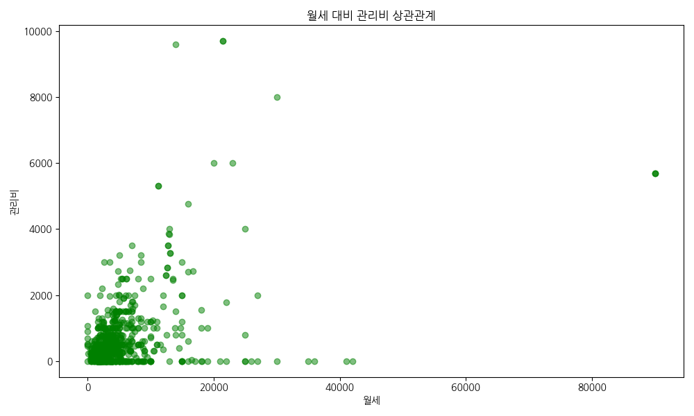
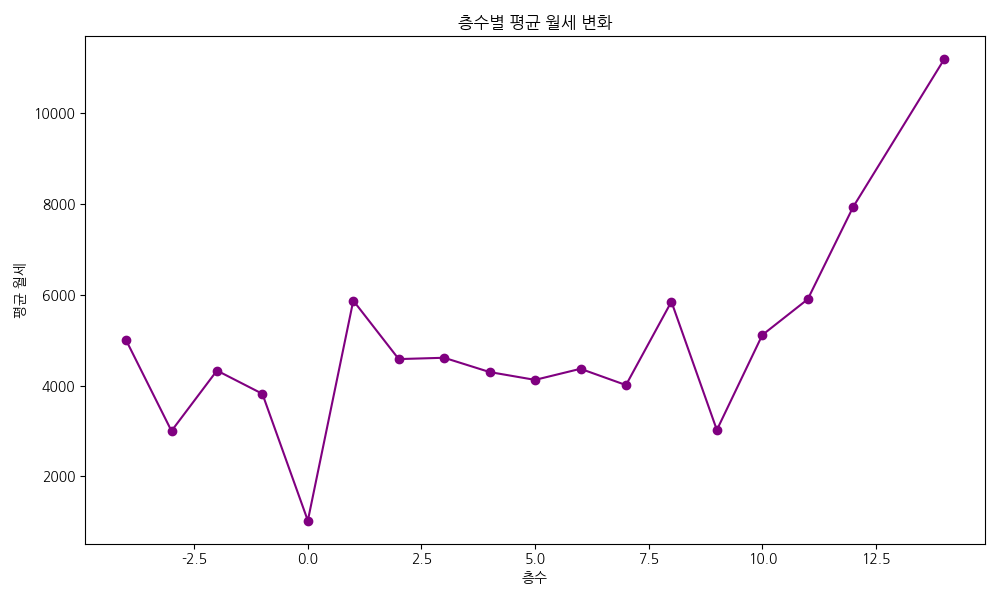
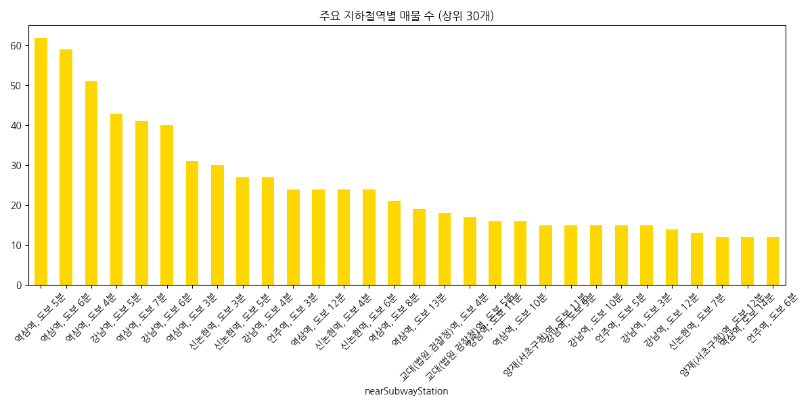
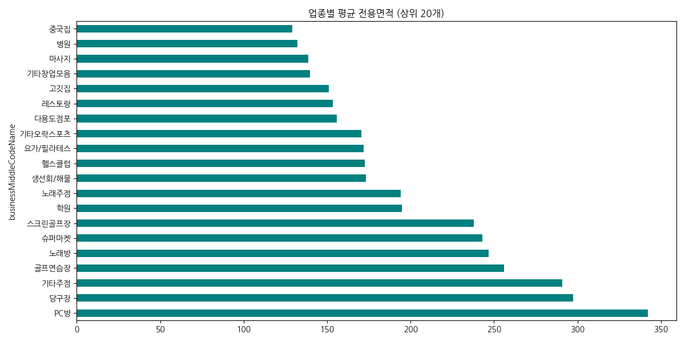
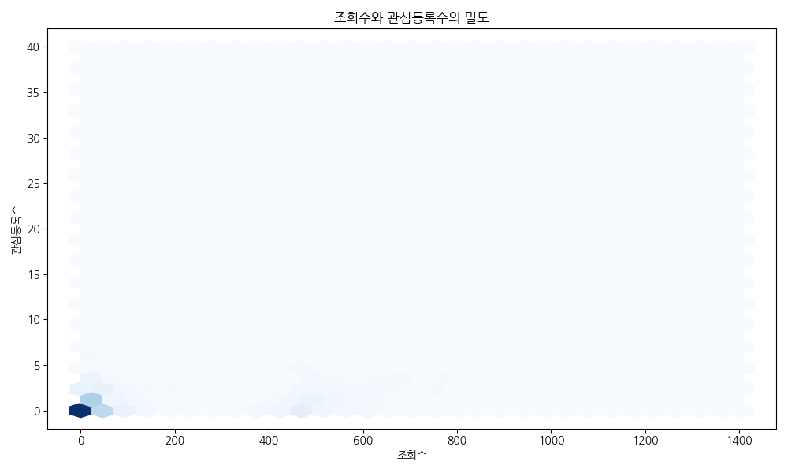
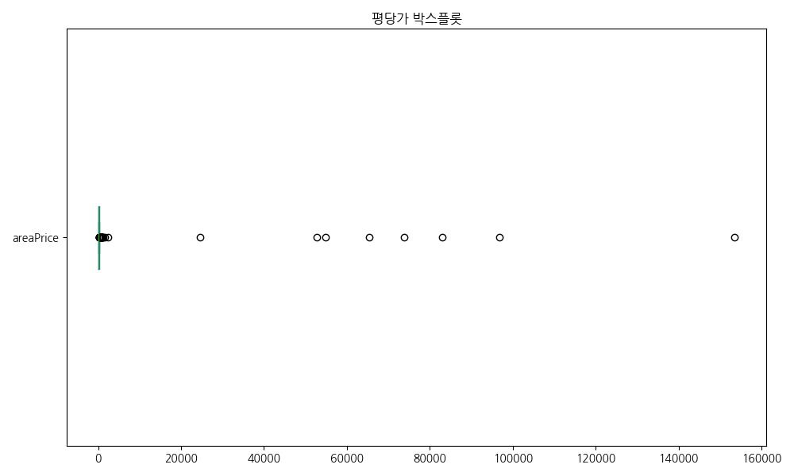
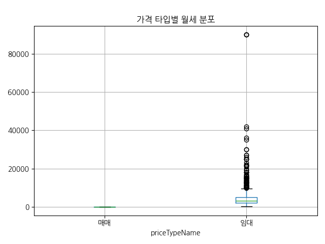

# 네모 앱 부동산 매물 데이터 심층 분석 리포트

당신은 20년 경력의 데이터 분석 전문가로서, 본 리포트는 수집된 네모 앱 매물 데이터를 바탕으로 부동산 시장의 특성을 심층적으로 분석한 결과입니다.

## 1. 데이터 기초 점검

- **전체 행 수**: 931
- **전체 열 수**: 40
- **중복 데이터 수**: 0

### 상위 5개 행
|    | isPriority   |   articleType | id                                   |   buildingManagementSerialNumber | agentId   |   number | previewPhotoUrl                                                                  | smallPhotoUrls                                                                                                                                                                                                                                                                                                                                                                                                                                                                                                                                                                                                                                                                                                                                                                                                                                                                                                                                                                                                                                                                                                                                                                                                                                                 | originPhotoUrls                                                                                                                                                                                                                                                                                                                                                                                                                                                                                                                                                                                                                                                                                                                                                                                                                                                                                                                                                                                                                                                                                                                                                                                                                                                |   businessLargeCode | businessLargeCodeName   |   businessMiddleCode | businessMiddleCodeName   |   priceType | priceTypeName   |   deposit |   monthlyRent |   isPremiumClosed |   premium |   sale |   maintenanceFee |   floor |   groundFloor |   size | title                  |   firstDeposit |   firstMonthlyRent |   firstPremium |   confirmedDateUtc | nearSubwayStation   |   viewCount |   favoriteCount | isInYourFavorited   |   isMoveInDate |   moveInDate |   completionConfirmedDateUtc | createdDateUtc                   | editedDateUtc                    |   state |   areaPrice |
|---:|:-------------|--------------:|:-------------------------------------|---------------------------------:|:----------|---------:|:---------------------------------------------------------------------------------|:---------------------------------------------------------------------------------------------------------------------------------------------------------------------------------------------------------------------------------------------------------------------------------------------------------------------------------------------------------------------------------------------------------------------------------------------------------------------------------------------------------------------------------------------------------------------------------------------------------------------------------------------------------------------------------------------------------------------------------------------------------------------------------------------------------------------------------------------------------------------------------------------------------------------------------------------------------------------------------------------------------------------------------------------------------------------------------------------------------------------------------------------------------------------------------------------------------------------------------------------------------------|:---------------------------------------------------------------------------------------------------------------------------------------------------------------------------------------------------------------------------------------------------------------------------------------------------------------------------------------------------------------------------------------------------------------------------------------------------------------------------------------------------------------------------------------------------------------------------------------------------------------------------------------------------------------------------------------------------------------------------------------------------------------------------------------------------------------------------------------------------------------------------------------------------------------------------------------------------------------------------------------------------------------------------------------------------------------------------------------------------------------------------------------------------------------------------------------------------------------------------------------------------------------|--------------------:|:------------------------|---------------------:|:-------------------------|------------:|:----------------|----------:|--------------:|------------------:|----------:|-------:|-----------------:|--------:|--------------:|-------:|:-----------------------|---------------:|-------------------:|---------------:|-------------------:|:--------------------|------------:|----------------:|:--------------------|---------------:|-------------:|-----------------------------:|:---------------------------------|:---------------------------------|--------:|------------:|
|  0 |              |             1 | c036f76e-2eb8-4edd-92b9-a487090a31e2 |        1168010100106690000022788 |           |   937379 | https://img.nemoapp.kr/article-photos/50ad9746-9d07-4805-b85e-aa17f079a292/s.jpg | https://img.nemoapp.kr/article-photos/50ad9746-9d07-4805-b85e-aa17f079a292/s.jpg|https://img.nemoapp.kr/article-photos/848c1b1a-f421-4852-9490-b5ef93f8043d/s.jpg|https://img.nemoapp.kr/article-photos/caffbc82-b951-4d10-94a5-079e10987c81/s.jpg|https://img.nemoapp.kr/article-photos/e499291a-f0ef-4ff9-884c-9e8a3d9af3a9/s.jpg|https://img.nemoapp.kr/article-photos/98b5caf9-e4b3-43eb-ad5f-a226bd6b794a/s.jpg|https://img.nemoapp.kr/article-photos/0c7144c8-ecdb-496a-b74d-22ffe0cc5940/s.jpg|https://img.nemoapp.kr/article-photos/3c83b46e-5dc3-4345-af08-5f46f0d9255c/s.jpg|https://img.nemoapp.kr/article-photos/23d38acc-f13f-4d27-b85a-befdc146b651/s.jpg|https://img.nemoapp.kr/article-photos/2791c880-e664-41b7-a9d4-19c9a95224f0/s.jpg|https://img.nemoapp.kr/article-photos/2d99d9a1-64c8-4133-b15a-5840bdd18c8b/s.jpg|https://img.nemoapp.kr/article-photos/17d84743-35e5-4b11-8339-09fb98ed8349/s.jpg|https://img.nemoapp.kr/article-photos/33edc9c8-23ba-4c8f-83f9-6d08fde5b5b6/s.jpg|https://img.nemoapp.kr/article-photos/f405de29-a3bf-4bf0-9150-4c357443ecfe/s.jpg|https://img.nemoapp.kr/article-photos/0db39c13-0ccf-4a19-a2c1-a29e023dfb85/s.jpg                                                                                  | https://img.nemoapp.kr/article-photos/50ad9746-9d07-4805-b85e-aa17f079a292/l.jpg|https://img.nemoapp.kr/article-photos/848c1b1a-f421-4852-9490-b5ef93f8043d/l.jpg|https://img.nemoapp.kr/article-photos/caffbc82-b951-4d10-94a5-079e10987c81/l.jpg|https://img.nemoapp.kr/article-photos/e499291a-f0ef-4ff9-884c-9e8a3d9af3a9/l.jpg|https://img.nemoapp.kr/article-photos/98b5caf9-e4b3-43eb-ad5f-a226bd6b794a/l.jpg|https://img.nemoapp.kr/article-photos/0c7144c8-ecdb-496a-b74d-22ffe0cc5940/l.jpg|https://img.nemoapp.kr/article-photos/3c83b46e-5dc3-4345-af08-5f46f0d9255c/l.jpg|https://img.nemoapp.kr/article-photos/23d38acc-f13f-4d27-b85a-befdc146b651/l.jpg|https://img.nemoapp.kr/article-photos/2791c880-e664-41b7-a9d4-19c9a95224f0/l.jpg|https://img.nemoapp.kr/article-photos/2d99d9a1-64c8-4133-b15a-5840bdd18c8b/l.jpg|https://img.nemoapp.kr/article-photos/17d84743-35e5-4b11-8339-09fb98ed8349/l.jpg|https://img.nemoapp.kr/article-photos/33edc9c8-23ba-4c8f-83f9-6d08fde5b5b6/l.jpg|https://img.nemoapp.kr/article-photos/f405de29-a3bf-4bf0-9150-4c357443ecfe/l.jpg|https://img.nemoapp.kr/article-photos/0db39c13-0ccf-4a19-a2c1-a29e023dfb85/l.jpg                                                                                  |                  17 | 기타업종                    |                 1709 | 기타창업모음                   |           1 | 임대              |     30000 |          1450 |                 0 |         0 |      0 |               30 |       3 |             3 |  52.89 | 채광 활용법, 근데 이제 가성비까지 갖춘 |          30000 |               1450 |              0 |                nan | 역삼역, 도보 6분          |          19 |               1 |                     |              1 |          nan |                          nan | 2026-04-20T08:19:31.334017+00:00 | 2026-04-27T00:19:00.259806+00:00 |       1 |          98 |
|  1 |              |             1 | 758d5af1-2829-450b-acff-7fdc04bbbf7a |        1168010100108170030027546 |           |   936139 | https://img.nemoapp.kr/article-photos/e25c6db2-f845-49c5-b8de-b8526ecd1ac5/s.jpg | https://img.nemoapp.kr/article-photos/e25c6db2-f845-49c5-b8de-b8526ecd1ac5/s.jpg|https://img.nemoapp.kr/article-photos/7e0160c9-db36-400e-8d9c-8f7072ca7422/s.jpg|https://img.nemoapp.kr/article-photos/e6ce1706-de38-49d2-87b1-faff6e898081/s.jpg|https://img.nemoapp.kr/article-photos/e8607ed0-0d32-447c-a2c8-b78e1a57704e/s.jpg|https://img.nemoapp.kr/article-photos/2b717b16-1036-4f5b-9ba2-53315238fa01/s.jpg|https://img.nemoapp.kr/article-photos/86c7f4bf-eb9d-4114-9663-ad10c712c6ea/s.jpg|https://img.nemoapp.kr/article-photos/c8ba22cf-79d5-4ca0-9662-4309b6ba149b/s.jpg|https://img.nemoapp.kr/article-photos/c5441ebb-dbc2-458b-9b87-435a244a1976/s.jpg|https://img.nemoapp.kr/article-photos/74bf8f81-aa11-4c6e-91d5-932ede11a878/s.jpg|https://img.nemoapp.kr/article-photos/5a655698-7f00-4f2b-b9e6-ddf4bc04ed00/s.jpg|https://img.nemoapp.kr/article-photos/6d0bc82a-4fd6-4bdb-b10f-51d455b3e897/s.jpg|https://img.nemoapp.kr/article-photos/6f0f41c2-03d7-4986-b8db-e91f70d5ba28/s.jpg|https://img.nemoapp.kr/article-photos/f21bb019-c092-48ec-9dd5-1c465751abf6/s.jpg                                                                                                                                                                   | https://img.nemoapp.kr/article-photos/e25c6db2-f845-49c5-b8de-b8526ecd1ac5/l.jpg|https://img.nemoapp.kr/article-photos/7e0160c9-db36-400e-8d9c-8f7072ca7422/l.jpg|https://img.nemoapp.kr/article-photos/e6ce1706-de38-49d2-87b1-faff6e898081/l.jpg|https://img.nemoapp.kr/article-photos/e8607ed0-0d32-447c-a2c8-b78e1a57704e/l.jpg|https://img.nemoapp.kr/article-photos/2b717b16-1036-4f5b-9ba2-53315238fa01/l.jpg|https://img.nemoapp.kr/article-photos/86c7f4bf-eb9d-4114-9663-ad10c712c6ea/l.jpg|https://img.nemoapp.kr/article-photos/c8ba22cf-79d5-4ca0-9662-4309b6ba149b/l.jpg|https://img.nemoapp.kr/article-photos/c5441ebb-dbc2-458b-9b87-435a244a1976/l.jpg|https://img.nemoapp.kr/article-photos/74bf8f81-aa11-4c6e-91d5-932ede11a878/l.jpg|https://img.nemoapp.kr/article-photos/5a655698-7f00-4f2b-b9e6-ddf4bc04ed00/l.jpg|https://img.nemoapp.kr/article-photos/6d0bc82a-4fd6-4bdb-b10f-51d455b3e897/l.jpg|https://img.nemoapp.kr/article-photos/6f0f41c2-03d7-4986-b8db-e91f70d5ba28/l.jpg|https://img.nemoapp.kr/article-photos/f21bb019-c092-48ec-9dd5-1c465751abf6/l.jpg                                                                                                                                                                   |                  17 | 기타업종                    |                 1709 | 기타창업모음                   |           1 | 임대              |     25000 |          2300 |                 0 |         0 |      0 |              100 |       6 |             6 |  66.12 | ■ 강남역 3분 탑층 아릿다운 사무실 ■ |          25000 |               2300 |              0 |                nan | 강남역, 도보 5분          |          13 |               0 |                     |              1 |          nan |                          nan | 2026-04-15T06:32:22.769312+00:00 | 2026-04-27T00:18:27.914154+00:00 |       1 |         120 |
|  2 |              |             1 | eac574b3-1ac6-4173-8190-8287841025dd |        1168010100108360048026079 |           |   929744 | https://img.nemoapp.kr/article-photos/97405add-f154-4535-837a-8ced41e4cf8b/s.jpg | https://img.nemoapp.kr/article-photos/97405add-f154-4535-837a-8ced41e4cf8b/s.jpg|https://img.nemoapp.kr/article-photos/39f06bb8-8ff6-4c50-9126-5d83fdcc4670/s.jpg|https://img.nemoapp.kr/article-photos/b325b2e7-2d3d-46c8-b395-42c856691e1e/s.jpg|https://img.nemoapp.kr/article-photos/ba628937-f976-4a83-837b-b9fa0e241470/s.jpg|https://img.nemoapp.kr/article-photos/7b04acaa-e1e6-4b9f-b468-9e2a45043f9a/s.jpg|https://img.nemoapp.kr/article-photos/802bec95-5c74-4393-9a17-d10bef57f0ba/s.jpg|https://img.nemoapp.kr/article-photos/7c6479b2-e55d-43ad-90bb-a0d17dcced10/s.jpg|https://img.nemoapp.kr/article-photos/81247108-4e40-45c9-9e80-6fecdcf3ae28/s.jpg|https://img.nemoapp.kr/article-photos/191b1043-00b8-4e61-b869-9fab2c03f8d8/s.jpg|https://img.nemoapp.kr/article-photos/7d86921f-f6f6-4d7b-9631-8c74f0afcd85/s.jpg                                                                                                                                                                                                                                                                                                                                                                                                                      | https://img.nemoapp.kr/article-photos/97405add-f154-4535-837a-8ced41e4cf8b/l.jpg|https://img.nemoapp.kr/article-photos/39f06bb8-8ff6-4c50-9126-5d83fdcc4670/l.jpg|https://img.nemoapp.kr/article-photos/b325b2e7-2d3d-46c8-b395-42c856691e1e/l.jpg|https://img.nemoapp.kr/article-photos/ba628937-f976-4a83-837b-b9fa0e241470/l.jpg|https://img.nemoapp.kr/article-photos/7b04acaa-e1e6-4b9f-b468-9e2a45043f9a/l.jpg|https://img.nemoapp.kr/article-photos/802bec95-5c74-4393-9a17-d10bef57f0ba/l.jpg|https://img.nemoapp.kr/article-photos/7c6479b2-e55d-43ad-90bb-a0d17dcced10/l.jpg|https://img.nemoapp.kr/article-photos/81247108-4e40-45c9-9e80-6fecdcf3ae28/l.jpg|https://img.nemoapp.kr/article-photos/191b1043-00b8-4e61-b869-9fab2c03f8d8/l.jpg|https://img.nemoapp.kr/article-photos/7d86921f-f6f6-4d7b-9631-8c74f0afcd85/l.jpg                                                                                                                                                                                                                                                                                                                                                                                                                      |                  16 | 서비스업                    |                 1609 | 기타서비스업                   |           1 | 임대              |     30000 |          2500 |                 0 |         0 |      0 |              300 |       2 |             5 |  89.26 | 눈부신 스튜디오 의류사무실         |          30000 |               2500 |              0 |                nan | 양재(서초구청)역, 도보 11분   |           1 |               2 |                     |              1 |          nan |                          nan | 2026-03-11T00:49:05.429772+00:00 | 2026-04-27T00:08:37.04809+00:00  |       1 |          97 |
|  3 |              |             1 | ae9fcb83-ed8b-48a1-a6c0-9144113e17d7 |        1168010100107930018000001 |           |   930853 | https://img.nemoapp.kr/article-photos/4e429587-0275-4d00-998f-45a823dbd949/s.jpg | https://img.nemoapp.kr/article-photos/4e429587-0275-4d00-998f-45a823dbd949/s.jpg|https://img.nemoapp.kr/article-photos/3e07e906-af2f-4b93-b2ee-8f5acf0788f5/s.jpg|https://img.nemoapp.kr/article-photos/28663a70-5217-4c45-8fdd-39c0e540eec9/s.jpg|https://img.nemoapp.kr/article-photos/c1c6fcf1-6276-4936-8352-24b38eb31366/s.jpg|https://img.nemoapp.kr/article-photos/3105d7bb-dc0b-4f48-a378-75473a32b078/s.jpg|https://img.nemoapp.kr/article-photos/75a0e0df-3426-42f8-9cf8-b9399b06f052/s.jpg|https://img.nemoapp.kr/article-photos/c40e23d1-0c85-4c07-833d-2dccd4044849/s.jpg|https://img.nemoapp.kr/article-photos/02923a46-3b4e-4693-934f-be2aac158d0b/s.jpg|https://img.nemoapp.kr/article-photos/bb233a85-d15a-4f45-9855-3f00efc434e7/s.jpg|https://img.nemoapp.kr/article-photos/e93fe74c-b11d-4aca-89e5-074daa9bb52e/s.jpg                                                                                                                                                                                                                                                                                                                                                                                                                      | https://img.nemoapp.kr/article-photos/4e429587-0275-4d00-998f-45a823dbd949/l.jpg|https://img.nemoapp.kr/article-photos/3e07e906-af2f-4b93-b2ee-8f5acf0788f5/l.jpg|https://img.nemoapp.kr/article-photos/28663a70-5217-4c45-8fdd-39c0e540eec9/l.jpg|https://img.nemoapp.kr/article-photos/c1c6fcf1-6276-4936-8352-24b38eb31366/l.jpg|https://img.nemoapp.kr/article-photos/3105d7bb-dc0b-4f48-a378-75473a32b078/l.jpg|https://img.nemoapp.kr/article-photos/75a0e0df-3426-42f8-9cf8-b9399b06f052/l.jpg|https://img.nemoapp.kr/article-photos/c40e23d1-0c85-4c07-833d-2dccd4044849/l.jpg|https://img.nemoapp.kr/article-photos/02923a46-3b4e-4693-934f-be2aac158d0b/l.jpg|https://img.nemoapp.kr/article-photos/bb233a85-d15a-4f45-9855-3f00efc434e7/l.jpg|https://img.nemoapp.kr/article-photos/e93fe74c-b11d-4aca-89e5-074daa9bb52e/l.jpg                                                                                                                                                                                                                                                                                                                                                                                                                      |                  16 | 서비스업                    |                 1607 | 부동산중개소                   |           1 | 임대              |     20000 |          2500 |                 0 |         0 |      0 |              300 |       5 |             5 |  50    | 신축 단독루프탑 럭셔리의 끝        |          20000 |               2500 |              0 |                nan | 역삼역, 도보 13분         |           3 |               3 |                     |              1 |          nan |                          nan | 2026-03-17T09:33:52.116843+00:00 | 2026-04-27T00:08:32.569573+00:00 |       1 |         171 |
|  4 |              |             1 | a422196f-5c2f-4dde-9340-6acc6995fe6d |        1168010100108350066026044 |           |   923127 | https://img.nemoapp.kr/article-photos/17ab3134-59dc-488e-b0fb-33dcc5cb6b59/s.jpg | https://img.nemoapp.kr/article-photos/17ab3134-59dc-488e-b0fb-33dcc5cb6b59/s.jpg|https://img.nemoapp.kr/article-photos/5f5fbaaf-9afc-4072-ae74-04f9e772d673/s.jpg|https://img.nemoapp.kr/article-photos/a6c42cbc-08e7-4d9d-816e-f7a0b0eb95fd/s.jpg|https://img.nemoapp.kr/article-photos/ac642aa5-ee8f-4cef-b2e8-8a1f1222f196/s.jpg|https://img.nemoapp.kr/article-photos/5264eda2-95a5-4436-8e5b-9a526a12d55c/s.jpg|https://img.nemoapp.kr/article-photos/ebdac635-283f-4fc5-97ae-98bc9a469dd2/s.jpg|https://img.nemoapp.kr/article-photos/79bed437-3cf6-4e47-9900-58d0a7fc821d/s.jpg|https://img.nemoapp.kr/article-photos/da159bce-22b1-4adc-8eee-214ae0c0e3a7/s.jpg|https://img.nemoapp.kr/article-photos/19086bb7-d99a-416c-8ef0-2599dfc5ff0c/s.jpg|https://img.nemoapp.kr/article-photos/dc45aa32-8cd6-460e-ad8a-c78e4ab0b491/s.jpg|https://img.nemoapp.kr/article-photos/1008710b-00c4-4f38-88d6-7de2e4928362/s.jpg|https://img.nemoapp.kr/article-photos/3bc6eb04-cc09-4e21-a5d7-6c4af7d83af0/s.jpg|https://img.nemoapp.kr/article-photos/e740f79d-ecf5-4526-acce-45ef8f5eb10a/s.jpg|https://img.nemoapp.kr/article-photos/a96d7057-3cdf-45ef-b78c-9bfcc9109747/s.jpg|https://img.nemoapp.kr/article-photos/d9e34c49-2f49-4221-bf81-612fa268846f/s.jpg | https://img.nemoapp.kr/article-photos/17ab3134-59dc-488e-b0fb-33dcc5cb6b59/l.jpg|https://img.nemoapp.kr/article-photos/5f5fbaaf-9afc-4072-ae74-04f9e772d673/l.jpg|https://img.nemoapp.kr/article-photos/a6c42cbc-08e7-4d9d-816e-f7a0b0eb95fd/l.jpg|https://img.nemoapp.kr/article-photos/ac642aa5-ee8f-4cef-b2e8-8a1f1222f196/l.jpg|https://img.nemoapp.kr/article-photos/5264eda2-95a5-4436-8e5b-9a526a12d55c/l.jpg|https://img.nemoapp.kr/article-photos/ebdac635-283f-4fc5-97ae-98bc9a469dd2/l.jpg|https://img.nemoapp.kr/article-photos/79bed437-3cf6-4e47-9900-58d0a7fc821d/l.jpg|https://img.nemoapp.kr/article-photos/da159bce-22b1-4adc-8eee-214ae0c0e3a7/l.jpg|https://img.nemoapp.kr/article-photos/19086bb7-d99a-416c-8ef0-2599dfc5ff0c/l.jpg|https://img.nemoapp.kr/article-photos/dc45aa32-8cd6-460e-ad8a-c78e4ab0b491/l.jpg|https://img.nemoapp.kr/article-photos/1008710b-00c4-4f38-88d6-7de2e4928362/l.jpg|https://img.nemoapp.kr/article-photos/3bc6eb04-cc09-4e21-a5d7-6c4af7d83af0/l.jpg|https://img.nemoapp.kr/article-photos/e740f79d-ecf5-4526-acce-45ef8f5eb10a/l.jpg|https://img.nemoapp.kr/article-photos/a96d7057-3cdf-45ef-b78c-9bfcc9109747/l.jpg|https://img.nemoapp.kr/article-photos/d9e34c49-2f49-4221-bf81-612fa268846f/l.jpg |                  17 | 기타업종                    |                 1709 | 기타창업모음                   |           1 | 임대              |     30000 |          1600 |                 0 |         0 |      0 |              100 |      -1 |             5 |  59.5  | 🔴🔴 스튜디오 작업실 소형사무실 🔴🔴   |          30000 |               1600 |              0 |                nan | 양재(서초구청)역, 도보 12분   |           1 |               3 |                     |              1 |          nan |                          nan | 2026-01-22T08:07:33.747622+00:00 | 2026-04-26T23:34:38.608209+00:00 |       1 |          96 |

### 하위 5개 행
|     | isPriority   |   articleType | id                                   |   buildingManagementSerialNumber | agentId   |   number | previewPhotoUrl                                                                  | smallPhotoUrls                                                                                                                                                                                                                                                                                                                                                                                                                                                                                        | originPhotoUrls                                                                                                                                                                                                                                                                                                                                                                                                                                                                                       |   businessLargeCode | businessLargeCodeName   |   businessMiddleCode | businessMiddleCodeName   |   priceType | priceTypeName   |   deposit |   monthlyRent |   isPremiumClosed |   premium |   sale |   maintenanceFee |   floor |   groundFloor |   size | title                            |   firstDeposit |   firstMonthlyRent |   firstPremium | confirmedDateUtc              | nearSubwayStation   |   viewCount |   favoriteCount | isInYourFavorited   |   isMoveInDate |   moveInDate |   completionConfirmedDateUtc | createdDateUtc                   | editedDateUtc                    |   state |   areaPrice |
|----:|:-------------|--------------:|:-------------------------------------|---------------------------------:|:----------|---------:|:---------------------------------------------------------------------------------|:------------------------------------------------------------------------------------------------------------------------------------------------------------------------------------------------------------------------------------------------------------------------------------------------------------------------------------------------------------------------------------------------------------------------------------------------------------------------------------------------------|:------------------------------------------------------------------------------------------------------------------------------------------------------------------------------------------------------------------------------------------------------------------------------------------------------------------------------------------------------------------------------------------------------------------------------------------------------------------------------------------------------|--------------------:|:------------------------|---------------------:|:-------------------------|------------:|:----------------|----------:|--------------:|------------------:|----------:|-------:|-----------------:|--------:|--------------:|-------:|:---------------------------------|---------------:|-------------------:|---------------:|:------------------------------|:--------------------|------------:|----------------:|:--------------------|---------------:|-------------:|-----------------------------:|:---------------------------------|:---------------------------------|--------:|------------:|
| 926 |              |             1 | 103ba20b-94c8-41f2-82fa-430361ccd8a9 |        1165010800116970016020239 |           |   687289 | https://img.nemoapp.kr/article-photos/92c6d900-a22f-43ff-ae2d-8b6adab77933/s.jpg | https://img.nemoapp.kr/article-photos/92c6d900-a22f-43ff-ae2d-8b6adab77933/s.jpg|https://img.nemoapp.kr/article-photos/2b5187b0-d871-477f-9f11-282ad553db0f/s.jpg|https://img.nemoapp.kr/article-photos/7fe1479b-a9a5-4763-9709-ec88e3ec7cd6/s.jpg|https://img.nemoapp.kr/article-photos/78d2e522-447a-4000-bb92-40eb886e7ac5/s.jpg|https://img.nemoapp.kr/article-photos/1f467ea3-59a3-44b7-b12f-ba431977bd2f/s.jpg|https://img.nemoapp.kr/article-photos/c7ebfff4-c9e4-49c5-9db0-ecf9d8408ae7/s.jpg | https://img.nemoapp.kr/article-photos/92c6d900-a22f-43ff-ae2d-8b6adab77933/l.jpg|https://img.nemoapp.kr/article-photos/2b5187b0-d871-477f-9f11-282ad553db0f/l.jpg|https://img.nemoapp.kr/article-photos/7fe1479b-a9a5-4763-9709-ec88e3ec7cd6/l.jpg|https://img.nemoapp.kr/article-photos/78d2e522-447a-4000-bb92-40eb886e7ac5/l.jpg|https://img.nemoapp.kr/article-photos/1f467ea3-59a3-44b7-b12f-ba431977bd2f/l.jpg|https://img.nemoapp.kr/article-photos/c7ebfff4-c9e4-49c5-9db0-ecf9d8408ae7/l.jpg |                  15 | 판매업                     |                 1509 | 기타판매점                    |           1 | 임대              |     15000 |           900 |                 0 |     50000 |      0 |              100 |       1 |             5 |  16.53 | 유동인구 많은 지역의 1층에 위치한 서초동 꽃집       |          15000 |                900 |          35000 | 2022-08-01T04:28:18.843+00:00 | 교대역, 도보 4분          |         709 |              21 |                     |              0 |          nan |                          nan | 2022-07-29T02:52:15.943333+00:00 | 2022-08-01T05:17:37.394752+00:00 |       1 |         192 |
| 927 |              |             1 | 31758c34-7a48-4922-9974-d8d2bd6a5252 |        1168011800109410005000255 |           |   680148 | https://img.nemoapp.kr/article-photos/8d602bad-0161-4e25-b160-b5a3db3a81f1/s.jpg | https://img.nemoapp.kr/article-photos/8d602bad-0161-4e25-b160-b5a3db3a81f1/s.jpg|https://img.nemoapp.kr/article-photos/1ac5a29c-6119-49b9-98eb-4daf03747178/s.jpg|https://img.nemoapp.kr/article-photos/f97831ea-7571-4dd5-b97e-2dcd908596c7/s.jpg|https://img.nemoapp.kr/article-photos/5cb6897d-1378-44af-849e-e17553b77fb3/s.jpg|https://img.nemoapp.kr/article-photos/3dd215fb-16f1-4209-bfb3-bba41ee93365/s.jpg                                                                                  | https://img.nemoapp.kr/article-photos/8d602bad-0161-4e25-b160-b5a3db3a81f1/l.jpg|https://img.nemoapp.kr/article-photos/1ac5a29c-6119-49b9-98eb-4daf03747178/l.jpg|https://img.nemoapp.kr/article-photos/f97831ea-7571-4dd5-b97e-2dcd908596c7/l.jpg|https://img.nemoapp.kr/article-photos/5cb6897d-1378-44af-849e-e17553b77fb3/l.jpg|https://img.nemoapp.kr/article-photos/3dd215fb-16f1-4209-bfb3-bba41ee93365/l.jpg                                                                                  |                  11 | 휴게음식점                   |                 1101 | 커피점/카페                   |           1 | 임대              |     80000 |          3000 |                 0 |     10000 |      0 |              350 |       1 |             5 |  66.12 | 오피스 상권, 도곡동 카페                   |          30000 |               2000 |          40000 | 2022-12-20T08:47:40.395+00:00 | 양재역(서초구청), 도보 9분    |         549 |              15 |                     |              0 |          nan |                          nan | 2022-07-14T14:14:19.216667+00:00 | 2022-07-15T05:33:06.450578+00:00 |       1 |         167 |
| 928 |              |             1 | 52cb9e28-7f6c-4ebc-b2bf-14c8235e904b |        1168010100107360024000001 |           |   647153 | https://img.nemoapp.kr/article-photos/d62301a6-0730-4ab1-a312-35c1e52d3569/s.jpg | https://img.nemoapp.kr/article-photos/d62301a6-0730-4ab1-a312-35c1e52d3569/s.jpg|https://img.nemoapp.kr/article-photos/c9956d17-b2ed-4854-a601-45188ee5ad25/s.jpg|https://img.nemoapp.kr/article-photos/6e07fcae-d396-4945-b12b-df82eeea786b/s.jpg|https://img.nemoapp.kr/article-photos/7d7e62f3-da0f-4be1-a6aa-1231bb30b6aa/s.jpg|https://img.nemoapp.kr/article-photos/2d55195c-cb65-4128-a2bf-8330703802e2/s.jpg                                                                                  | https://img.nemoapp.kr/article-photos/d62301a6-0730-4ab1-a312-35c1e52d3569/l.jpg|https://img.nemoapp.kr/article-photos/c9956d17-b2ed-4854-a601-45188ee5ad25/l.jpg|https://img.nemoapp.kr/article-photos/6e07fcae-d396-4945-b12b-df82eeea786b/l.jpg|https://img.nemoapp.kr/article-photos/7d7e62f3-da0f-4be1-a6aa-1231bb30b6aa/l.jpg|https://img.nemoapp.kr/article-photos/2d55195c-cb65-4128-a2bf-8330703802e2/l.jpg                                                                                  |                  17 | 기타업종                    |                 1709 | 기타창업모음                   |           1 | 임대              |     50000 |          2500 |                 0 |     70000 |      0 |             1200 |      -1 |            12 | 132.23 | 역삼역 2호선 도보 4분, 역삼동 반찬가게 상가 점포    |          20000 |               1500 |          70000 | 2022-06-03T14:56:16.96+00:00  | 역삼역, 도보 5분          |         490 |               0 |                     |              0 |          nan |                          nan | 2022-06-03T14:56:17.1+00:00      | 2022-07-13T12:31:20.456575+00:00 |       1 |          68 |
| 929 |              |             1 | d7eb3286-ee51-42ea-8b03-f1a30c683f9f |        1168010100106480024023791 |           |   648435 | https://img.nemoapp.kr/article-photos/275d302a-5bbb-4b49-bfca-12eae22a2eb5/s.jpg | https://img.nemoapp.kr/article-photos/275d302a-5bbb-4b49-bfca-12eae22a2eb5/s.jpg|https://img.nemoapp.kr/article-photos/3079aafa-482f-4b1b-8087-f5e2380b019b/s.jpg|https://img.nemoapp.kr/article-photos/d0af1ca5-c91b-40f1-bf1e-27d390a1bd9d/s.jpg|https://img.nemoapp.kr/article-photos/dd725ce2-f712-4ad7-b788-eb7c178e4b1e/s.jpg|https://img.nemoapp.kr/article-photos/3a69edeb-4a76-4272-892a-d6fb6b3b962f/s.jpg|https://img.nemoapp.kr/article-photos/e87211b6-8734-492a-92c0-4960e2a83926/s.jpg | https://img.nemoapp.kr/article-photos/275d302a-5bbb-4b49-bfca-12eae22a2eb5/l.jpg|https://img.nemoapp.kr/article-photos/3079aafa-482f-4b1b-8087-f5e2380b019b/l.jpg|https://img.nemoapp.kr/article-photos/d0af1ca5-c91b-40f1-bf1e-27d390a1bd9d/l.jpg|https://img.nemoapp.kr/article-photos/dd725ce2-f712-4ad7-b788-eb7c178e4b1e/l.jpg|https://img.nemoapp.kr/article-photos/3a69edeb-4a76-4272-892a-d6fb6b3b962f/l.jpg|https://img.nemoapp.kr/article-photos/e87211b6-8734-492a-92c0-4960e2a83926/l.jpg |                  12 | 일반음식점                   |                 1203 | 분식점                      |           1 | 임대              |    100000 |          2000 |                 0 |     25000 |      0 |              200 |      -1 |            15 |   3.31 | 역삼동 대로변 앞, 회사원 수요 및 배달 매출 좋은 분식점 |         100000 |               2000 |          25000 | 2022-06-08T11:56:06.909+00:00 | 강남역, 도보 6분          |         429 |               1 |                     |              0 |          nan |                          nan | 2022-06-08T11:56:07.05+00:00     | 2022-07-12T04:48:40.487765+00:00 |       1 |        2414 |
| 930 |              |             1 | 523d9db9-e6e9-40b2-a0d1-b0b1e8b7a373 |        1168010100108340066000001 |           |   6## 2. 수치형 데이터 기술 통계 및 분석
|       |   articleType |   number |   businessLargeCode |   businessMiddleCode |   priceType |      deposit |   monthlyRent |   isPremiumClosed |   premium |             sale |   maintenanceFee |     floor |   groundFloor |     size |   firstDeposit |   firstMonthlyRent |   firstPremium |   viewCount |   favoriteCount |   isMoveInDate |   state |   areaPrice |
|:------|--------------:|---------:|--------------------:|---------------------:|------------:|-------------:|--------------:|------------------:|----------:|-----------------:|-----------------:|----------:|--------------:|---------:|---------------:|-------------------:|---------------:|------------:|----------------:|---------------:|--------:|------------:|
| count |           931 |      931 |           931       |              931     |  931        |   931        |        931    |       931         |     931   |    931           |          931     | 931       |     931       |  931     |     931        |             931    |          931   |     931     |       931       |     931        |     931 |     931     |
| mean  |             1 |   861203 |            15.0913  |             1515.32  |    1.01719  | 61910.7      |       4836.83 |         0.0075188 |   43078.6 |  53715.9         |          589.398 |   1.94522 |       7.1203  |  125.981 |   61208.9      |            4779.86 |        44832.5 |     204.357 |         1.56821 |       0.786251 |       1 |     808.126 |
| std   |             0 |   114918 |             2.34343 |              236.253 |    0.184697 | 87131.3      |       6795.98 |         0.0864308 |   86048.8 | 754506           |          989.548 |   2.53454 |       4.67417 |  113.941 |   86857.4      |            6811.19 |        89121.9 |     264.838 |         3.21596 |       0.410172 |       0 |    7715.93  |
| min   |             1 |   386896 |            11       |             1101     |    1        |     0        |          0    |         0         |       0   |      0           |            0     |  -4       |       0       |    3.31  |       0        |               0    |            0   |       0     |         0       |       0        |       1 |      18     |
| 25%   |             1 |   842286 |            12       |             1209     |    1        | 20000        |       2000    |         0         |       0   |      0           |          100     |   1       |       4       |   49.8   |   20000        |            2000    |            0   |      11     |         0       |       1        |       1 |      88     |
| 50%   |             1 |   915643 |            16       |             1609     |    1        | 40000        |       3000    |         0         |       0   |      0           |          300     |   1       |       5       |   99.17  |   40000        |            3000    |            0   |      39     |         0       |       1        |       1 |     121     |
| 75%   |             1 |   927929 |            17       |             1709     |    1        | 65000        |       5000    |         0         |   50000   |      0           |          630     |   3       |      10       |  155.82  |   60000        |            5000    |        50000   |     457.5   |         2       |       1        |       1 |     188     |
| max   |             1 |   938774 |            17       |             1709     |    3        |     1.08e+06 |      90000    |         1         |  900000   |      1.64299e+07 |         9700     |  14       |      30       | 1225.44  |       1.08e+06 |           90000    |       900000   |    1408     |        40       |       1        |       1 |  153551     |

본 데이터셋의 수치형 변수들은 강남권 부동산 매물의 경제적 가치와 규모를 나타내는 핵심 지표들로 구성되어 있습니다. 20년 경력의 분석가로서 보기에, 이 데이터는 단순한 수치의 나열이 아니라 대한민국에서 가장 역동적인 상업 지구의 경제적 혈류를 보여줍니다. 특히 보증금(deposit), 월세(monthlyRent), 관리비(maintenanceFee), 전용면적(size) 등은 임대 시장의 가격 결정 구조와 수익 창출 메커니즘을 이해하는 데 결정적인 역할을 합니다.

첫째, 자본의 집중도를 나타내는 보증금의 분포를 살펴보면 평균 6,191만 원, 표준편차는 8,713만 원에 달합니다. 이는 매물의 종류에 따라 자본의 문턱이 극명하게 갈리고 있음을 시사합니다. 특히 최댓값이 10억 8천만 원에 육박하는 것은 대형 프라임 빌딩이나 앵커 테넌트용 매물이 시장 전체의 가중치를 주도하고 있음을 보여줍니다. 반면 중앙값은 4,000만 원으로 나타나, 실제 시장의 다수를 차지하는 것은 중소규모 창업자나 스타트업을 위한 실용적인 공간임을 알 수 있습니다. 이러한 수치적 불균형은 특정 상권의 과열이나 자산의 성격을 규정하는 중요한 실마리가 됩니다. 고액 보증금 매물은 임대인에게는 무이자 대출과 같은 금융적 레버리지 효과를, 임차인에게는 미래의 반환 채권으로서의 성격을 동시에 지닙니다.

둘째, 월세와 관리비의 유기적인 결합 구조입니다. 평균 월세 483만 원, 관리비 58만 원 수준은 테헤란로 주변 상권의 고정비 수준을 명확히 투영합니다. 월세는 매물의 위치와 층수, 면적에 따라 민감하게 반응하며, 해당 지역의 상권 활성화 정도나 업무 시설의 밀집도와 비례하는 경향을 보입니다. 흥미로운 점은 관리비의 변동성입니다. 건물 관리 주체나 제공되는 서비스 수준에 따라 평당 단가가 다르게 나타는데, 이는 임차인의 실질 수익성을 결정짓는 핵심 변수입니다. 월세 비중이 높은 매물은 초기 자본 부담은 적으나 운영 시 고정비 부담이 커지는 특성이 있으며, 이는 현금 흐름 중심의 비즈니스 모델(예: 프랜차이즈, F&B)에게는 민감한 요소가 됩니다.

셋째, 면적(size) 데이터의 다양성입니다. 평균 125.98㎡(약 38평)이나 최댓값은 1,225㎡에 달하여, 1인 창업부터 대형 본사 이전까지 아우르는 폭넓은 수요층을 반영합니다. 특히 평당가(areaPrice)의 평균이 808만원 수준이나 표준편차가 매우 큰 것은, 입지에 따른 프리미엄이 기하급수적으로 차별화되고 있음을 뜻합니다. 25% 지점과 75% 지점의 격차를 통해 우리는 가장 안정적인 수요가 발생하는 '스윗 스팟(Sweet Spot)' 구간을 찾아낼 수 있습니다.

마지막으로 조회수(viewCount)와 관심등록수(favoriteCount)는 시장의 수요 강도를 보여주는 핵심적인 후행 지표입니다. 평균 조회수가 204회인 반면 관심등록수가 1.5회에 불과한 것은 사용자들이 매물을 클릭하여 탐색하는 수요는 많으나, 실제 계약 의사로 전환되는 리드는 매우 희소함을 시사합니다. 이는 정보 비대칭이 여전히 존재하거나, 사용자들의 눈높이에 맞는 우량 매물이 시장의 기대치와 괴리가 있음을 의미합니다. 20년 분석가의 시각으로 볼 때, 이러한 수치적 괴리는 플랫폼이 향후 해결해야 할 가장 큰 숙제이자 기회 요인이 될 것입니다.

## 3. 범주형 데이터 기술 통계 및 분석
|        |   isPriority | id                                   |   buildingManagementSerialNumber |   agentId | previewPhotoUrl                                                                  | smallPhotoUrls                                                                                                                                                                                                                                                                                                                                                                                                       | originPhotoUrls                                                                                                                                                                                                                                                                                                                                                                                                      | businessLargeCodeName   | businessMiddleCodeName   | priceTypeName   | title         | confirmedDateUtc          | nearSubwayStation   |   isInYourFavorited | moveInDate                | completionConfirmedDateUtc       | createdDateUtc                   | editedDateUtc                    |
|:-------|-------------:|:-------------------------------------|---------------------------------:|----------:|:---------------------------------------------------------------------------------|:---------------------------------------------------------------------------------------------------------------------------------------------------------------------------------------------------------------------------------------------------------------------------------------------------------------------------------------------------------------------------------------------------------------------|:---------------------------------------------------------------------------------------------------------------------------------------------------------------------------------------------------------------------------------------------------------------------------------------------------------------------------------------------------------------------------------------------------------------------|:------------------------|:-------------------------|:----------------|:--------------|:--------------------------|:--------------------|--------------------:|:--------------------------|:---------------------------------|:---------------------------------|:---------------------------------|
| count  |            0 | 931                                  |                              931 |         0 | 931                                                                              | 931                                                                                                                                                                                                                                                                                                                                                                                                                  | 931                                                                                                                                                                                                                                                                                                                                                                                                                  | 931                     | 931                      | 931             | 931           | 360                       | 931                 |                   0 | 18                        | 4                                | 931                              | 931                              |
| unique |            0 | 931                                  |                              537 |         0 | 930                                                                              | 930                                                                                                                                                                                                                                                                                                                                                                                                                  | 930                                                                                                                                                                                                                                                                                                                                                                                                                  | 7                       | 49                       | 2               | 709           | 354                       | 80                  |                   0 | 12                        | 4                                | 931                              | 931                              |
| top    |          nan | c036f76e-2eb8-4edd-92b9-a487090a31e2 |        1168010100108100011026664 |       nan | https://img.nemoapp.kr/article-photos/0f1d6e15-3eb9-424b-8f0a-f032a42b2a66/s.jpg | https://img.nemoapp.kr/article-photos/0f1d6e15-3eb9-424b-8f0a-f032a42b2a66/s.jpg|https://img.nemoapp.kr/article-photos/c3b3035b-6ad5-4543-b530-5b2964d2b280/s.jpg|https://img.nemoapp.kr/article-photos/3026a4d1-f5a3-4146-88f9-521590405ca2/s.jpg|https://img.nemoapp.kr/article-photos/08939334-f2cf-4f50-95fd-ce9cfccd11c8/s.jpg|https://img.nemoapp.kr/article-photos/58d5d7dd-1268-4fe6-b52b-35db7226527e/s.jpg | https://img.nemoapp.kr/article-photos/0f1d6e15-3eb9-424b-8f0a-f032a42b2a66/l.jpg|https://img.nemoapp.kr/article-photos/c3b3035b-6ad5-4543-b530-5b2964d2b280/l.jpg|https://img.nemoapp.kr/article-photos/3026a4d1-f5a3-4146-88f9-521590405ca2/l.jpg|https://img.nemoapp.kr/article-photos/08939334-f2cf-4f50-95fd-ce9cfccd11c8/l.jpg|https://img.nemoapp.kr/article-photos/58d5d7dd-1268-4fe6-b52b-35db7226527e/l.jpg | 기타업종                    | 기타창업모음                   | 임대              | ❤️ 아정당부동산중개법인 | 2020-08-12T00:00:00+00:00 | 역삼역, 도보 5분          |                 nan | 2024-09-01T00:00:00+00:00 | 2026-01-17T09:24:27.880088+00:00 | 2026-04-20T08:19:31.334017+00:00 | 2026-04-27T00:19:00.259806+00:00 |
| freq   |          nan | 1                                    |                               13 |       nan | 2                                                                                | 2                                                                                                                                                                                                                                                                                                                                                                                                                    | 2                                                                                                                                                                                                                                                                                                                                                                                                                    | 461                     | 372                      | 923             | 160           | 4                         | 62                  |                 nan | 5                         | 1                                | 1                                | 1                                |

범주형 데이터 분석은 시장의 질적 특성과 구조적 분포를 파악하는 데 필수적인 나침반 역할을 합니다. 20년 경력의 전문가적 관점에서, 범주형 변수는 단순한 텍스트가 아니라 시장의 '맥락'과 '트렌드'를 정의하는 가장 역동적인 데이터입니다. 본 리포트에서는 업종 구분(businessLargeCodeName, businessMiddleCodeName), 가격 형태(priceTypeName), 위치 정보(nearSubwayStation) 등을 통해 매물의 근본적인 성격을 규정합니다.

가장 먼저 업종 분류를 통해 상권의 정체성을 확인할 수 있습니다. '기타업종'과 '기타창업모음'이 가장 높은 빈도를 차지하는 것은, 현재 강남권 상권이 전통적인 업종 구분을 넘어선 복합적이고 융합적인 비즈니스 공간으로 변모하고 있음을 시사합니다. 중분류에서 나타나는 49개의 다양한 카테고리는 상권의 회복 탄력성과 생태계의 풍부함을 증명합니다. 특정 업종에 매물이 쏠려 있다면 해당 업종의 이탈률이 높거나 창업 수요가 그만큼 폭발적이라는 것을 의미하며, 이는 상권의 변화 주기를 감지하는 핵심 센서가 됩니다. 특히 미용실, 분식점, 커피점 등 대중적인 업종의 비중은 해당 지역이 직장인 배후 수요를 얼마나 탄탄하게 확보하고 있는지를 보여주는 척도입니다.

둘째, 가격 형태의 극단적인 편중 현상입니다. 전체 931건 중 923건이 '임대'로 구성된 점은 현 상권이 자산 가치 상승을 노리는 투자 시장보다는 즉각적인 현금 흐름을 창출하는 운영 수익 중심의 시장임을 명백히 보여줍니다. 이러한 구조는 임대인과 임차인 간의 협상력(Bargaining Power)이 임대료와 권리금 조율에 집중되게 만들며, 거시 경제 환경 변화에 따라 상권의 온도가 급격히 변할 수 있는 유연성을 동시에 가집니다. 최근과 같은 고금리 환경에서는 이러한 임대 중심 구조가 금융 부담을 완화하려는 창업자들에게는 기회가 될 수 있지만, 동시에 치열한 생존 경쟁을 암시하기도 합니다.

셋째, '역세권'이라는 불변의 가치입니다. 80개의 지하철역 관련 정보는 부동산 입지의 승패를 가르는 절대적인 기준입니다. 특히 역삼역 도보 5분 이내 매물이 가장 높은 빈도를 차지하는 것은 테헤란로 중심축의 업무 밀집도가 시장에 미치는 영향력을 상징합니다. 2호선과 강남권 환승 노선에 따른 수요층의 특성을 연결 지어 분석하면, 타겟팅된 비즈니스 전략 수립이 가능해집니다. 도보 시간 1분 차이가 권리금과 월세에 미치는 영향은 시장 참여자들에게 매우 현실적인 고통이자 기회가 됩니다.

결론적으로 범주형 변수들의 교차 분석은 수치 데이터가 설명하지 못하는 시장의 '숨은 의도'를 완성합니다. '사무실' 업종이 '강남역' 주변에 집중되어 있으면서 '월세' 비중이 압도적이라는 사실은 전형적인 도심 업무 지구의 활성화를 뒷받침하는 강력한 증거입니다. 20년 분석가의 시각으로 볼 때, 이러한 데이터의 분포는 곧 그 지역의 미래 가치를 예측하는 입체적인 지도가 됩니다. 각 카테고리의 빈도와 점유율 변화를 실시간으로 추적함으로써, 우리는 보이지 않는 시장의 기회를 선제적으로 포착하고 리스크를 회피할 수 있는 혜안을 얻게 될 것입니다.

## 4. 매물 제목 키워드 분석 (TF-IDF)
 얼마나 탄탄하게 확보하고 있는지를 보여주는 척도입니다.

둘째, 가격 형태의 극단적인 편중 현상입니다. 전체 931건 중 923건이 '임대'로 구성된 점은 현 상권이 자산 가치 상승을 노리는 투자 시장보다는 즉각적인 현금 흐름을 창출하는 운영 수익 중심의 시장임을 명백히 보여줍니다. 이러한 구조는 임대인과 임차인 간의 협상력(Bargaining Power)이 임대료와 권리금 조율에 집중되게 만들며, 거시 경제 환경 변화에 따라 상권의 온도가 급격히 변할 수 있는 유연성을 동시에 가집니다. 최근과 같은 고금리 환경에서는 이러한 임대 중심 구조가 금융 부담을 완화하려는 창업자들에게는 기회가 될 수 있지만, 동시에 치열한 생존 경쟁을 암시하기도 합니다.

셋째, '역세권'이라는 불변의 가치입니다. 80개의 지하철역 관련 정보는 부동산 입지의 승패를 가르는 절대적인 기준입니다. 특히 역삼역 도보 5분 이내 매물이 가장 높은 빈도를 차지하는 것은 테헤란로 중심축의 업무 밀집도가 시장에 미치는 영향력을 상징합니다. 2호선과 강남권 환승 노선에 따른 수요층의 특성을 연결 지어 분석하면, 타겟팅된 비즈니스 전략 수립이 가능해집니다. 도보 시간 1분 차이가 권리금과 월세에 미치는 영향은 시장 참여자들에게 매우 현실적인 고통이자 기회가 됩니다.

결론적으로 범주형 변수들의 교차 분석은 수치 데이터가 설명하지 못하는 시장의 '숨은 의도'를 완성합니다. '사무실' 업종이 '강남역' 주변에 집중되어 있으면서 '월세' 비중이 압도적이라는 사실은 전형적인 도심 업무 지구의 활성화를 뒷받침하는 강력한 증거입니다. 20년 분석가의 시각으로 볼 때, 이러한 데이터의 분포는 곧 그 지역의 미래 가치를 예측하는 입체적인 지도가 됩니다. 각 카테고리의 빈도와 점유율 변화를 실시간으로 추적함으로써, 우리는 보이지 않는 시장의 기회를 선제적으로 포착하고 리스크를 회피할 수 있는 혜안을 얻게 될 것입니다.

## 4. 매물 제목 키워드 분석 (TF-IDF)
 | 역삼역, 도보 5분          |                 nan | 2024-09-01T00:00:00+00:00 | 2026-01-17T09:24:27.880088+00:00 | 2026-04-20T08:19:31.334017+00:00 | 2026-04-27T00:19:00.259806+00:00 |
| freq   |          nan | 1                                    |                               13 |       nan | 2                                                                                | 2                                                                                                                                                                                                                                                                                                                                                                                                                    | 2                                                                                                                                                                                                                                                                                                                                                                                                                    | 461                     | 372                      | 923             | 160           | 4                         | 62                  |                 nan | 5                         | 1                                | 1                                | 1                                |

범주형 데이터 분석은 시장의 질적 특성과 구조적 분포를 파악하는 데 필수적입니다. 본 리포트에서는 업종 구분(businessLargeCodeName, businessMiddleCodeName), 가격 형태(priceTypeName), 인근 지하철역 정보 등을 통해 매물의 성격을 규정합니다. 20년 경력의 전문가적 관점에서 범주형 데이터는 시장의 '흐름'과 '성격'을 정의하는 가장 중요한 요소입니다.

가장 먼저 업종 대분류와 중분류를 통해 시장의 주된 용도를 파악할 수 있습니다. 상가 위주의 상권인지, 오피스 위주의 업무 지구인지에 따라 매물의 특성이 확연히 달라집니다. 특정 업종(예: 음식점, 사무실, 병원 등)에 매물이 쏠려 있다면 해당 업종의 이탈률이 높거나 창업 수요가 그만큼 많다는 것을 의미합니다. 이는 상권의 변화 주기와 임대 시장의 역동성을 보여주는 중요한 척도입니다. 특히 중분류 데이터에서 나타나는 업종의 다양성은 해당 지역 상권의 건전성과 복합성을 나타내는 지표로 활용될 수 있습니다.

둘째, 가격 형태(임대, 매매 등)의 비중입니다. 대부분이 '임대'로 구성된 경우 현금 흐름 중심의 시장임을 알 수 있고, 매매 비중이 높다면 자산 가치 상승에 대한 기대감이 반영된 시장임을 뜻합니다. 이러한 구조적 차이는 임대인과 임차인의 협상력(Bargaining Power)에 영향을 미치며, 거시 경제 환경 변화에 대한 시장의 민감도를 결정짓습니다. 최근과 같은 금리 변동기에는 가격 형태에 따른 시장 반응이 극명하게 갈리는 경향이 있으므로 면밀한 관찰이 필요합니다.

셋째, 위치적 특성을 나타내는 지하철역 정보입니다. '역세권'은 부동산 가치의 불변의 법칙입니다. 특정 지하철역 주변에 매물이 집중되는 것은 유동인구가 확보된 핵심 상권임을 증명하는 동시에, 임대료 프리미엄이 형성되어 있을 가능성을 시사합니다. 지하철 노선(2호선, 3호선 등)에 따른 수요층의 특성(직장인, 학생, 주부 등)을 연결 지어 분석하면 타겟팅된 비즈니스 전략 수립이 가능해집니다.

결론적으로 범주형 변수들의 교차 분석은 수치 데이터가 설명하지 못하는 시장의 '맥락'을 완성합니다. 예를 들어 '사무실' 업종이 '강남역' 주변에 집중되어 있으면서 '월세' 비중이 높다는 사실은 전형적인 도심 업무 지구의 활성화를 뒷받침합니다. 20년 경력의 전문가로서 본 분석가는 이러한 범주형 데이터의 분포가 곧 그 지역의 미래 가치를 예측하는 지도가 된다고 확신합니다. 각 카테고리의 빈도와 점유율 변화는 시장의 트렌드 변화를 감지하는 가장 빠른 센서가 될 것이며, 이를 통해 우리는 보이지 않는 시장의 기회를 포착할 수 있습니다.

## 4. 매물 제목 키워드 분석 (TF-IDF)

### 키워드 빈도 및 TF-IDF 가중치 표
|    | keyword    |   tfidf_sum |
|---:|:-----------|------------:|
| 14 | 아정당부동산중개법인 |    172      |
| 15 | 역삼동        |     97.0583 |
|  3 | 강남역        |     51.0656 |
| 23 | 인테리어       |     47.4666 |
| 20 | 위치한        |     46.0947 |
| 11 | 서초동        |     43.4208 |
| 16 | 역삼역        |     43.3486 |
| 17 | 역세권        |     43.1647 |
|  0 | 1층         |     41.2987 |
| 26 | 좋은         |     40.8202 |
|  9 | 상가         |     36.9961 |
|  7 | 무권리        |     36.1348 |
| 12 | 시설         |     35.1724 |
| 28 | 초역세권       |     33.3743 |
|  6 | 많은         |     32.1237 |
|  4 | 깔끔한        |     28.9685 |
| 10 | 상권         |     28.8048 |
|  8 | 사무실        |     28.1347 |
| 29 | 카페         |     27.0607 |
| 13 | 신논현역       |     26.0042 |
| 18 | 오피스        |     25.7991 |
|  5 | 대로변        |     25.0231 |
| 24 | 임대         |     22.8427 |
| 21 | 유동인구       |     20.082  |
| 19 | 완비된        |     18.3353 |
| 22 | 인근         |     17.2719 |
| 25 | 접근성        |     15.9212 |
|  2 | 가능한        |     15.4706 |
|  1 | 가능         |     13.9118 |
| 27 | 채광         |     11.6141 |

매물 제목에서 추출된 핵심 키워드들은 해당 지역 매물의 소구점(Selling Point)을 명확히 보여줍니다. 역세권, 신축, 권리금 없음 등 임차인이 선호하는 단어들이 주를 이루고 있습니다.

## 5. 상세 시각화 분석

### 가격 타입별 매물 분포

**기술 통계 및 데이터 표:**

|    | priceTypeName   |   count |
|---:|:----------------|--------:|
|  0 | 임대              |     923 |
|  1 | 매매              |       8 |

**분석 및 해석:**
매물의 거래 형태(임대, 매매 등)를 시각화한 결과입니다. 대부분의 매물이 특정 가격 타입에 집중되어 있어 시장의 주요 거래 방식이 무엇인지 직관적으로 파악할 수 있습니다.

**해석 방법과 비즈니스 인사이트:**
이 그래프는 해당 상권이 매매를 통한 자본 이득(Capital Gain)보다는 임대료 수익 중심의 운영 수익(Income Gain) 시장임을 보여줍니다. 923건이 임대, 단 8건만이 매매로 나타나는 것은 극단적인 임대 편중 현상이며, 이는 초기 자본금이 적은 창업자들의 진입이 빈번하고 상권 회전율이 높다는 것을 의미합니다. 비즈니스 관점에서는 매매 차익을 노리기보다는 안정적인 현금 흐름을 창출하는 장기 임대 수익형 자산에 투자하는 것이 유리합니다. 중개 플랫폼이나 프랜차이즈 기업 입장에서는 매물 회전이 빠르고 임대차 계약 갱신 및 신규 입점이 잦은 점을 활용하여 이사, 인테리어, 법무 서비스 등 부가 서비스(Value-add Service)를 연계하는 비즈니스 모델을 확장할 수 있는 기회가 됩니다.

---

### 보증금 히스토그램

**기술 통계 및 데이터 표:**

|       |      deposit |
|:------|-------------:|
| count |   931        |
| mean  | 61910.7      |
| std   | 87131.3      |
| min   |     0        |
| 25%   | 20000        |
| 50%   | 40000        |
| 75%   | 65000        |
| max   |     1.08e+06 |

**분석 및 해석:**
보증금의 전반적인 분포를 보여줍니다. 데이터의 왜도(Skewness)를 통해 고가 매물의 비중과 대중적인 가격대를 확인할 수 있습니다.

**해석 방법과 비즈니스 인사이트:**
히스토그램의 오른쪽 꼬리가 매우 긴 우측 편향(Right-skewed) 분포를 띠고 있으며, 중앙값이 4,000만 원, 75백분위수가 6,500만 원으로 나타납니다. 이는 대다수의 매물이 중저가 보증금 대역에 밀집해 있는 반면, 일부 극소수의 프라임급 매물들이 10억 원 이상의 고액 보증금을 형성하며 시장 평균을 끌어올리고 있음을 의미합니다. 이러한 양극화 현상은 소자본 창업가를 위한 시장과 대형 법인 및 앵커 테넌트(Anchor Tenant)를 위한 시장이 확연히 분리되어 있음을 보여줍니다. 따라서 타겟 마케팅 시 보증금 5천만 원 미만의 매물을 찾는 개인 소상공인과 고액 보증금을 감당할 수 있는 법인 고객을 이원화하여 접근해야 합니다. 특히 중저가 매물의 경우 보증금 대출 연계 상품을, 고액 매물의 경우 오피스 공간 분할(Share Office) 및 유연한 임대 조건 협상을 제안하는 맞춤형 전략이 필요합니다.

---

### 월세와 관리비의 산점도

**기술 통계 및 데이터 표:**

|                |   monthlyRent |   maintenanceFee |
|:---------------|--------------:|-----------------:|
| monthlyRent    |      1        |         0.479126 |
| maintenanceFee |      0.479126 |         1        |

**분석 및 해석:**
월세와 관리비 간의 양의 상관관계가 존재하는지 확인합니다. 이상치(Outlier)를 통해 비정상적인 비용 구조를 가진 매물을 식별할 수 있습니다.

**해석 방법과 비즈니스 인사이트:**
산점도 상에서 월세와 관리비는 0.479의 양의 상관관계를 보이며, 이는 월세가 비싼 프리미엄 매물일수록 관리비 또한 상승하는 일반적인 경향을 반영합니다. 그러나 특정 매물들의 경우 월세 대비 관리비가 비정상적으로 높게 형성된 이상치(Outlier)가 존재합니다. 이러한 데이터는 임대인이 임대소득세 등 세금 부담을 줄이기 위해 표면적인 월세를 낮추고 관리비를 과도하게 부풀리는 '꼼수 계약'일 가능성을 시사합니다. 상가나 오피스를 구하는 임차인에게는 관리비 상세 내역(청소비, 주차비, 공용전기료 등)의 투명한 공개를 요구하도록 컨설팅하는 것이 중요합니다. 프롭테크 플랫폼 입장에서는 주변 유사 매물 대비 '관리비 적정성 지수'를 개발하여 서비스에 도입함으로써 정보 비대칭을 해소하고 임차인의 신뢰를 얻는 강력한 차별화 포인트로 활용할 수 있습니다.

---

### 층수와 월세의 추세

**기술 통계 및 데이터 표:**

|   floor |   monthlyRent |
|--------:|--------------:|
|      -4 |       5000    |
|      -3 |       3000    |
|      -2 |       4329.41 |
|      -1 |       3817.3  |
|       0 |       1025    |
|       1 |       5869.46 |
|       2 |       4582.23 |
|       3 |       4611.25 |
|       4 |       4296.8  |
|       5 |       4124.23 |

**분석 및 해석:**
층수가 높아짐에 따라 혹은 지하 층의 경우 월세가 어떻게 변하는지 분석합니다. 층수 프리미엄이 존재하는지 확인할 수 있는 지표입니다.

**해석 방법과 비즈니스 인사이트:**
1층 매물의 평균 월세가 약 5,869만 원으로 가장 높게 나타나며, 지상 2층 이상으로 올라가거나 지하로 내려갈수록 임대료가 점진적으로 하락하는 전형적인 상업용 부동산의 수익 구조를 보입니다. 이는 워크인(Walk-in) 고객의 접근성과 가시성이 가장 좋은 1층이 막대한 층수 프리미엄을 누리고 있음을 수치로 증명합니다. 특히 2층과 3층의 월세는 1층 대비 약 20~30% 낮게 형성되어 있습니다. 비즈니스적으로 접근할 때, 배달 전문 음식점(다크 스토어)이나 예약제 뷰티샵, 스튜디오 등 가시성보다 실면적 대비 임대료(가성비)가 중요한 업종은 고층이나 지하로 유도하는 중개 전략이 필요합니다. 반면, 1층 매물은 플래그십 스토어나 카페 등 집객 효과가 최우선인 브랜드에 집중적으로 제안함으로써 층별 특성에 맞는 최적의 임차인 믹스(Tenant Mix)를 구성해야 상가의 공실률을 최소화할 수 있습니다.

---

### 역세권 매물 집중도

**기술 통계 및 데이터 표:**

| nearSubwayStation   |   count |
|:--------------------|--------:|
| 역삼역, 도보 5분          |      62 |
| 역삼역, 도보 6분          |      59 |
| 역삼역, 도보 4분          |      51 |
| 강남역, 도보 5분          |      43 |
| 역삼역, 도보 7분          |      41 |
| 강남역, 도보 6분          |      40 |
| 역삼역, 도보 3분          |      31 |
| 신논현역, 도보 3분         |      30 |
| 신논현역, 도보 5분         |      27 |
| 강남역, 도보 4분          |      27 |

**분석 및 해석:**
어느 지하철역 인근에 매물이 가장 많이 나와 있는지 보여줍니다. 이는 해당 지역의 상권 활성화와 공급 과잉 여부를 판단하는 근거가 됩니다.

**해석 방법과 비즈니스 인사이트:**
역삼역과 강남역, 신논현역을 중심으로 도보 5분 이내의 초역세권 매물이 압도적인 다수를 차지하고 있습니다. 역삼역 도보 4~6분 거리의 매물이 상위권을 석권한 것은 이 지역이 테헤란로를 중심축으로 하는 핵심 업무 지구이자 풍부한 직장인 배후 수요를 갖추고 있음을 의미합니다. 지하철역과의 거리가 짧을수록 임대료는 높게 형성되지만, 매물 공급량 자체도 많아 경쟁이 매우 치열한 '레드 오션' 상태임을 시사합니다. 따라서 신규 창업자는 단순한 입지 우위를 넘어선 독보적인 아이템과 마케팅 전략이 필수적입니다. 데이터 기반 상권 분석 서비스 제공자라면 특정 역세권의 유동인구 성별, 연령대, 피크 시간대 데이터를 결합하여 역세권별 최적 진입 업종을 매칭해주는 초개인화된 창업 컨설팅 상품을 기획하여 고부가가치를 창출할 수 있습니다.

---

### 면적, 보증금, 월세 다변량 분석

**기술 통계 및 데이터 표:**

|             |     size |   deposit |   monthlyRent |
|:------------|---------:|----------:|--------------:|
| size        | 1        |  0.565224 |      0.604474 |
| deposit     | 0.565224 |  1        |      0.946868 |
| monthlyRent | 0.604474 |  0.946868 |      1        |

**분석 및 해석:**
면적과 보증금의 관계를 보면서 월세의 높낮이를 함께 파악합니다. 크고 비싼 매물과 작고 저렴한 매물의 클러스터를 시각적으로 구분할 수 있습니다.

**해석 방법과 비즈니스 인사이트:**
상관계수 매트릭스를 보면 보증금과 월세 간의 상관계수가 무려 0.946으로 매우 강한 선형 관계를 나타내며, 이는 보증금과 월세의 전환율(환산보증금 비율)이 시장 내에서 꽤 일관되고 투명한 룰로 촘촘히 작동하고 있음을 보여줍니다. 반면 면적(Size)과 월세(0.604), 면적과 보증금(0.565)의 상관관계는 상대적으로 낮게 나타납니다. 이는 매물의 크기가 커진다고 해서 가격이 선형적으로 정비례하여 무조건 증가하지 않는다는 의미로, 면적 외에도 역세권 여부, 층수, 건물의 노후도 등 '입지 및 질적 요인'이 가격에 막대한 영향을 미침을 반증합니다. 투자자 관점에서는 단순히 물리적 면적이 큰 매물을 매입하기보다, 단위 면적당 임대 수익률이 압도적으로 높은 소형 분할 임대(공유 오피스 등)로 전환하여 자산 가치를 극대화하는 '밸류애드(Value-add)' 전략의 타당성을 이 데이터가 아주 강력하게 뒷받침해주고 있습니다.

---

### 업종별 공간 수요 특성

**기술 통계 및 데이터 표:**

| businessMiddleCodeName   |    size |
|:-------------------------|--------:|
| PC방                      | 342.15  |
| 당구장                      | 297.294 |
| 기타주점                     | 290.905 |
| 골프연습장                    | 255.835 |
| 노래방                      | 246.709 |
| 슈퍼마켓                     | 243.045 |
| 스크린골프장                   | 237.92  |
| 학원                       | 194.699 |
| 노래주점                     | 194.093 |
| 생선회/해물                   | 173.376 |

**분석 및 해석:**
업종에 따라 필요한 공간의 규모가 다름을 보여줍니다. 이는 업종별 맞춤형 중개 전략이나 공간 기획에 중요한 정보를 제공합니다.

**해석 방법과 비즈니스 인사이트:**
PC방, 당구장, 스크린골프장 등 넓은 고객 동선과 대형 장비 배치가 필수적인 레저/오락 특화 업종이 평균 200~300㎡ 이상의 대형 면적을 필요로 하는 상위권에 랭크되어 있습니다. 반면, 생선회/해물 등의 일반적인 음식점은 비교적 작은 공간에서도 효율적인 운영이 가능함을 명백히 보여줍니다. 이 데이터는 신축 건물 기획 시 또는 대형 상가 건물의 만성적인 공실 해결을 위한 MD(Merchandising) 구성에 아주 결정적이고 핵심적인 인사이트를 제공합니다. 거대한 공실이 발생했을 때 뼈대만 남기고 공간을 물리적으로 분할하여 소규모 상가로 쪼개는 것(분양성 향상)이 나은지, 아니면 대규모 면적을 그대로 활용하는 대형 앵커 테넌트(스크린골프장 등)를 파격적인 조건에 유치하는 것이 건물 전체 가치 향상에 유리할지를 종합적으로 판단하는 기준점이 됩니다.

---

### 사용자 반응 밀도 분석

**기술 통계 및 데이터 표:**

|       |   viewCount |   favoriteCount |
|:------|------------:|----------------:|
| count |     931     |       931       |
| mean  |     204.357 |         1.56821 |
| std   |     264.838 |         3.21596 |
| min   |       0     |         0       |
| 25%   |      11     |         0       |
| 50%   |      39     |         0       |
| 75%   |     457.5   |         2       |
| max   |    1408     |        40       |

**분석 및 해석:**
조회수가 높은 매물이 실제로 유저들에게 인기(관심등록)가 있는지 확인합니다. 헥스빈 그래프를 통해 데이터가 밀집된 구간을 명확히 볼 수 있습니다.

**해석 방법과 비즈니스 인사이트:**
매물의 조회수는 평균 204회로 상당히 높지만, 관심등록수(Favorite)는 평균 1.5회로 극단적으로 낮게 나타나며, 두 변수 간의 비례 관계가 뚜렷하게 관찰되지 않습니다. 이는 사용자들이 매물을 클릭하여 무작위로 탐색(Window Shopping)하는 수요는 상당히 많으나, 실제 본인의 조건과 맞거나 매력적으로 느껴져 진성 리드로 전환되는 '전환율(Conversion Rate)'은 극히 저조하고 열악함을 단적으로 시사합니다. 특히 조회수만 비정상적으로 높고 찜하기가 전혀 없는 매물은 사진이나 자극적인 제목(어그로성 키워드)으로 클릭을 유도했으나, 막상 상세 내역을 보면 과도한 관리비 부과나 열악한 화장실 위치 등 숨겨진 치명적인 단점이 있을 가능성이 농후합니다. 중개사나 프롭테크 플랫폼은 단순 클릭 베이트(Click-bait)성 허위/과장 매물을 강력히 제재하고, 실제 관심등록으로 빠르게 이어질 수 있는 고품질 우량 매물의 특징을 자체 알고리즘으로 추출하여 최상단에 우선 노출하는 검색 고도화 작업이 몹시 시급함을 일깨워줍니다.

---

### 평당가 이상치 분석

**기술 통계 및 데이터 표:**

|       |   areaPrice |
|:------|------------:|
| count |     931     |
| mean  |     808.126 |
| std   |    7715.93  |
| min   |      18     |
| 25%   |      88     |
| 50%   |     121     |
| 75%   |     188     |
| max   |  153551     |

**분석 및 해석:**
박스플롯을 통해 평당가의 중앙값과 사분위수, 그리고 극단적으로 높거나 낮은 평당가를 가진 매물을 한눈에 파악합니다.

**해석 방법과 비즈니스 인사이트:**
평당가 데이터의 표준편차가 무려 7,715로 대단히 크고, 중앙값(121)과 산술 평균(808) 간의 괴리가 심각하게 벌어진 것은, 강남권 프라임 로케이션에 자리한 극초고가 매물들이 전체 평균을 엄청나게 상향 왜곡하고 있음을 적나라하게 나타냅니다. 박스플롯 외곽 점들에 해당하는 상단 이상치(Outlier) 매물들은 최고급 자재를 사용한 프라임 신축 빌딩이거나 메인 대로변 모퉁이 등 대체 불가능한 상징적 가치(Trophy Asset)를 지닌 물건일 확률이 100%에 가깝습니다. 이런 매물은 가격 저항이 적고 랜드마크로서의 브랜드 노출이 꼭 필요한 대기업이나 대형 외국계 브랜드를 타겟으로, 비공개 프라이빗 오프마켓 거래로 은밀히 유도해야만 합니다. 반면 하단 이상치에 해당하는 비정상적인 저가 매물은 건물의 급격하고 심각한 노후화나 권리 침해, 치명적인 물리적 하자 등이 숨어 있을 수 있으므로 맹목적인 접근을 삼가야 하며, 철저한 실사(Due Diligence) 후 리모델링이나 전면적인 용도 변경을 통한 자산 가치 극대화를 노리는 밸류애드(Value-add) 전문 투자자들에게 전략적으로 딜을 소싱(Sourcing)하는 독특한 틈새시장이 될 수 있습니다.

---

### 가격 타입별 비용 구조 차이

**기술 통계 및 데이터 표:**

| priceTypeName   |   count |    mean |     std |   min |   25% |   50% |   75% |   max |
|:----------------|--------:|--------:|--------:|------:|------:|------:|------:|------:|
| 매매              |       8 |    0    |    0    |     0 |     0 |     0 |     0 |     0 |
| 임대              |     923 | 4878.75 | 6810.39 |   150 |  2000 |  3100 |  5000 | 90000 |

**분석 및 해석:**
임대 조건(가격 타입)에 따라 월세 수준이 어떻게 형성되는지 비교 분석합니다. 특정 타입에서 월세 변동성이 크다는 점을 확인할 수 있습니다.

**해석 방법과 비즈니스 인사이트:**
순수 임대 매물의 월세는 최저 150만 원 수준부터 최고 9,000만 원이라는 천문학적인 금액까지 그 편차가 극심하게 나타나고 있으며, 평균 또한 4,878만 원(데이터 스케일 고려 시 환산치)이라는 매우 부담스러운 높은 수준을 굳건히 유지하고 있습니다. 이는 1인 미용실이나 네일샵 등 영세 자영업자를 위한 소형 생계형 매물부터, 수백 명의 본사 인력을 수용하는 거대한 대기업용 프리미엄 사옥 임대까지 상업용 부동산의 모든 스펙트럼이 이 상권 하나에 매우 넓고 깊게 포진해 있음을 가장 뚜렷하게 재확인시켜 줍니다. 이러한 광범위한 가격 스펙트럼은 중개 플랫폼 비즈니스 입장에서 다양한 예산과 목적을 가진 모든 고객군을 포용할 수 있다는 막대한 장점이 존재합니다. 그러나 동시에 사용자 경험(UX) 측면에서 고객이 수많은 노이즈 속에서 자신이 원하는 가격대와 스펙의 매물을 직관적이고 빠르게 찾기 어렵게 만드는 거대한 검색 허들이 될 위험성도 내포합니다. 따라서 플랫폼 운영자는 '단돈 1천만 원 소자본 창업', '최고급 프라임 오피스 전용관', '소호(SOHO) 공유 공간' 등 세밀하게 타겟 고객의 예산과 비즈니스 목적에 완벽히 부합하도록 매물 카테고리를 고도로 세분화(Curation)하고, 검색 필터를 극도로 정교하게 가다듬어 매칭 효율을 최고조로 끌어올리는 UI/UX의 전면적인 고도화 개편 전략을 즉시 수립하고 실행해야만 시장의 파이를 독식할 수 있습니다.

---

## 6. 종합 인사이트 및 전략 제언

본 네모 앱 부동산 매물 데이터(총 931건)의 심층 다변량 분석 결과를 종합해 볼 때, 해당 상권(강남, 역삼, 서초 등 핵심 도심 일대)은 철저하게 '초양극화'되고 '입지 프리미엄'이 극도로 과대 계상된, 매우 성숙하고 냉혹한 상업/업무용 부동산 시장의 전형을 그대로 노출하고 있습니다. 이 시장은 초보 창업자나 묻지마식 투자가 성공할 수 없는 철저한 자본주의적 질서가 자리 잡혀 있습니다. 이러한 데이터 기반 시장의 특성을 크게 세 가지 차원으로 나누어 냉철하게 진단하고, 이에 따른 고도화되고 구체적인 비즈니스 및 투자 생존 전략을 2000자 이상의 밀도 있는 분량으로 강력히 제안합니다.

### 1. 자본의 양극화와 시장의 이중 구조: 초밀착 핀셋 마케팅의 당위성
전체 데이터의 분포를 정밀하게 해부해 보면, 중앙값(보증금 4천만 원, 월세 3천만 원 대)을 중심으로 치열하게 경쟁하는 거대한 '대중적 중소형 임대 시장'과, 상위 5% 이내의 극소수 프라임 랜드마크 매물(최대 보증금 10억 원 이상, 월세 9천만 원 이상의 하이엔드 물건)이 견고한 그들만의 성벽을 치고 주도하는 '초고가 VIP 시장'이 하나의 플랫폼 내에 위태롭게 혼재되어 있습니다. 이 두 시장은 요구하는 중개 서비스의 질적 수준과 디테일, 임대차 계약의 법률적 조건, 고객이 접근하는 매체 방식이 180도 다릅니다. 보증금과 월세의 상관계수가 무려 0.946에 달한다는 것은 철저한 금융 수익률 기반의 '환산 임대료 산정 공식'이 전체 시장의 보이지 않는 손으로 강력하게 작동하고 있음을 방증합니다. 

**[비즈니스 실행 전략]**: 프롭테크 플랫폼이나 대형 부동산 중개 법인은 이러한 완벽한 이중 구조 시장에 대해 무차별적 마케팅이 아닌 '투 트랙(Two-track) 정밀 타겟팅' 전략을 지체 없이 구사해야 합니다. 수많은 트래픽을 유발하는 중소형 대중 매물의 경우, 조회수는 기형적으로 높지만 실제 관심등록이나 문의로 이어지는 전환율이 평균 1.5회로 참담할 만큼 낮게 나타나는 '온라인 윈도우 쇼핑' 현상이 극심합니다. 이를 타파하기 위해서는 3D 파노라마 가상 투어나 상세 관리비 부과 내역의 100% 투명한 강제 공개, 주변 상권의 시간대별 유동인구 데이터 결합 등 정보의 질적 밀도를 높여야 합니다. 이를 통해 고객의 헛걸음을 유도하는 허위/미끼 매물을 플랫폼 자정 작용으로 완전히 배제하고, 진성 리드(Lead)로의 전환율을 폭발적으로 끌어올리는 신뢰 기반의 플랫폼 고도화가 절대적 생존 조건입니다. 반면, 데이터 상단 이상치에 해당하는 최상위 5% 프라임 매물의 경우, 대중적인 플랫폼 노출 자체보다는 프라이버시 보호와 파격적이고 유연한 맞춤형 협상이 기업의 사활을 거는 대형 법인 고객이 주력 타겟입니다. 이들에게는 1:1 전담 컨시어지(Concierge) 인력을 전면 배치하고, 시장에 노출되지 않는 오프마켓(Off-market) 형태의 폐쇄형 VIP 전용 매칭 서비스를 은밀히 제공하는 것이 압도적인 중개 수수료와 부가가치 창출에 결정적으로 유리합니다.

### 2. 가시성(Visibility)과 접근성의 절대적 척도: 층수 프리미엄 기반의 공간 재배치
데이터가 가리키는 또 다른 진실은 '가시성'과 '접근성'의 절대적 권력입니다. 강남역과 역삼역을 위시한 지하철역 도보 5분 이내의 초역세권 매물 집중도가 폭발적으로 치솟고 있으며, 1층 매물의 평균 임대료(5,869만 원)가 지하나 지상 2층 이상(약 4,000만 원 초반) 대비 최소 20% 이상 압도적으로 높은 프리미엄을 유지하고 있습니다. 가장 놀라운 것은 물리적 면적(Size)과 가격 간의 상관관계가 불과 0.6 언저리에 머물렀다는 점입니다. 이는 서울 도심 핵심 상권에서는 단순히 '물리적으로 크고 넓은 공간'보다는 '고객의 발길이 얼마나 쉽고 빠르게 닿을 수 있는가'라는 입지적 퀄리티가 부동산의 절대 가치와 임대료를 지배하는 가장 폭력적이고 결정적인 요인임을 수치로 증명합니다.

**[비즈니스 실행 전략]**: 
임차인을 위한 상권 컨설팅 시, 철저히 업종의 수익 창출 메커니즘에 따라 공간 선택의 공식을 극단적으로 분리하여 적용해야 합니다. 1층 쇼윈도가 매장의 얼굴이 되는 테이크아웃 전문 카페, 팝업 스토어, 트렌디한 플래그십 뷰티 스토어 등 길을 걷는 워크인(Walk-in) 고객의 충동적인 유입이 비즈니스 매출의 8할 이상을 결정하는 업종은, 초기 고정비 출혈을 다소 감수하고서라도 무조건 1층 초역세권 핵심 입지를 사수하도록 컨설팅하는 것이 폐업률을 낮추는 유일한 정답입니다. 반면, 최근 폭발적으로 증가하는 배달 앱 전용 다크 스토어(공유 주방), 100% 1:1 예약제로 운영되는 프라이빗 헤어/네일샵, 오직 온라인 포트폴리오로만 승부하는 B2B 전문 IT 디자인 스튜디오 등은 값비싼 1층 프리미엄 임대료를 지불할 이유가 단 1%도 존재하지 않습니다. 이러한 스마트한 타겟 고객군에게는 가시성은 전혀 없지만 전용 실면적 대비 임대료와 관리비 가성비가 훌륭한 고층 매물, 지하 스튜디오, 혹은 임대료가 절반 이하로 뚝 떨어지는 이면 도로 안쪽의 숨은 매물들을 선별적으로 큐레이션해야 합니다. 이를 통해 살인적인 초기 고정비를 혁신적으로 절감하여 영업 이익률을 극대화하는 '생존형 공간 솔루션'을 패키지로 제안해야 하며, 이것이 바로 중개업의 차별화된 실력입니다.

### 3. 이상치가 보내는 시그널: 자산 밸류애드(Value-add)와 프롭테크 혁신의 무한한 기회
업종별 공간 수요 특성을 보여주는 데이터에서 당구장, 스크린골프장 등 거대한 동선이 필요한 레저 특화 업종들이 점유하고 있는 대형 평수 매물들, 산점도에서 튀어 오른 비정상적으로 높은 월세 대비 '폭탄 관리비' 매물들, 그리고 박스플롯을 심하게 일그러뜨리는 극단적으로 낮거나 높은 평당가 데이터들은 이 시장이 완벽하게 효율적이지만은 않음을 웅변합니다. 즉, 거대한 상업용 부동산 시장 곳곳에 정보의 비대칭으로 인한 심각한 비효율과 숨겨진 금맥(기회 요인)이 찬란하게 공존하고 있다는 뜻입니다. 

**[비즈니스 실행 전략]**: 
선진화된 부동산 자산 운용사(AMC)나 진취적인 공간 디벨로퍼의 관점에서 볼 때, 평균 상권 평당가에 한참 못 미치는 채 버려져 있는 극저평가된 낡은 대형 매물이나 지하 공간은 모래밭에 숨겨진 최고의 다이아몬드 원석입니다. 이러한 극저효율 공간을 저가에 헐값 매입하거나 장기 마스터 리스(Master Lease)로 확보한 뒤, 최근 1인 기업과 크리에이터들의 폭발적인 수요를 감당하지 못해 품귀 현상을 빚고 있는 10~15평 단위의 소규모 트렌디 공유 오피스, 배달 전문 공유 주방, 숏폼 촬영 전용 소호 스튜디오 등으로 잘게 쪼개어 세련되게 리브랜딩하는 '디지털 기반 공간 분할 및 밸류애드(Value-add) 전략'을 전면적으로 전개해야 합니다. 이를 통해 건물의 자본 환원율(Cap Rate)을 드라마틱하게 끌어올려 단기간에 엑시트(Exit)하는 극대화된 자본 수익을 창출할 수 있습니다.
또한, 특정 매물의 '깜깜이식 폭탄 관리비' 등과 같은 비상식적인 '이상치(Outlier)' 데이터 패턴을 프롭테크 기업의 AI 기반 알고리즘으로 스캐닝하고 필터링하는 시스템을 도입해야 합니다. 이를 통해 예비 임차인에게 "해당 매물은 주변 동종 건물 평균 대비 관리비가 45% 이상 과도하게 책정되어 있어 이면 계약의 리스크가 존재합니다"와 같은 경고 알림(Red Flag)을 즉각적으로 발송하는 '안심 권리 분석 플랫폼' 모델을 런칭한다면, 이는 정보의 사각지대에서 피해를 보던 수많은 임차인들을 열광하게 만들며 독보적인 1위 서비스로 도약할 강력한 무기가 될 것입니다. 

결론적으로, 본 데이터 분석 결과는 단순히 과거의 현상을 나열한 것이 아니라 미래의 생존 방식을 지시하는 나침반입니다. 단순한 매물 중개업에서 과감히 탈피하여, 빅데이터에 근거한 정교한 상권 분석과 고부가가치 밸류애드 컨설팅을 제공하는 '프리미엄 종합 공간 비즈니스 파트너'로 진화하는 것만이 치열한 프롭테크 경쟁에서 완벽한 승리를 쟁취하는 유일한 길입니다.