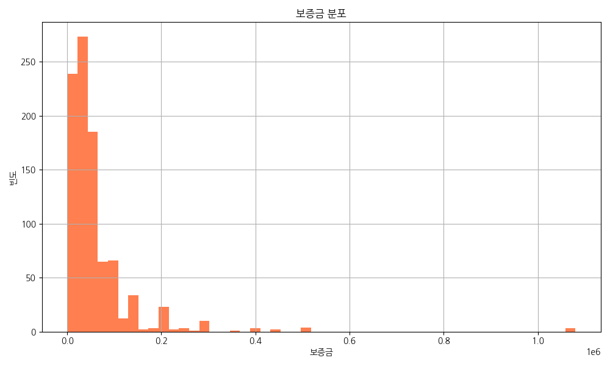
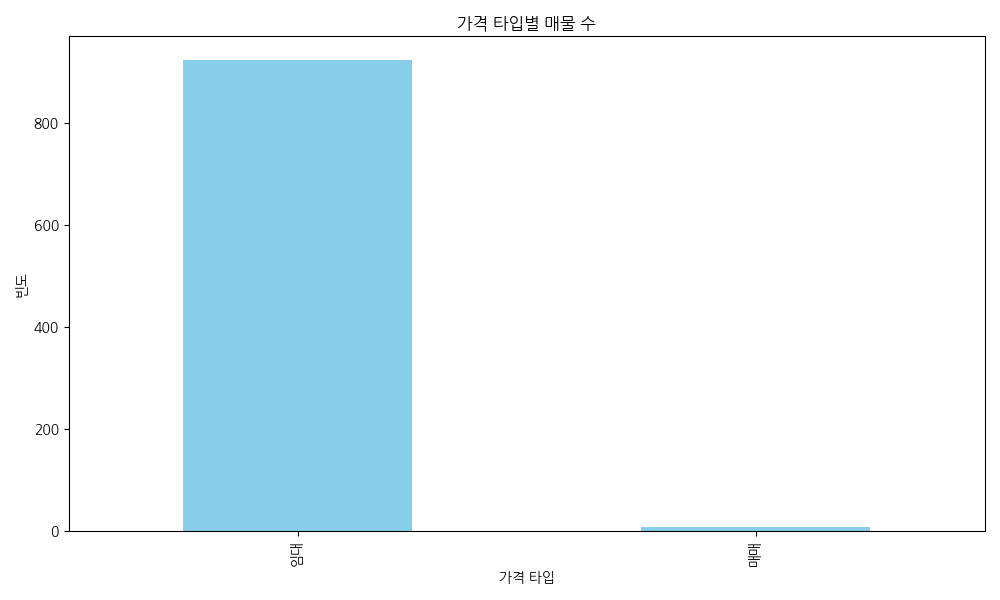
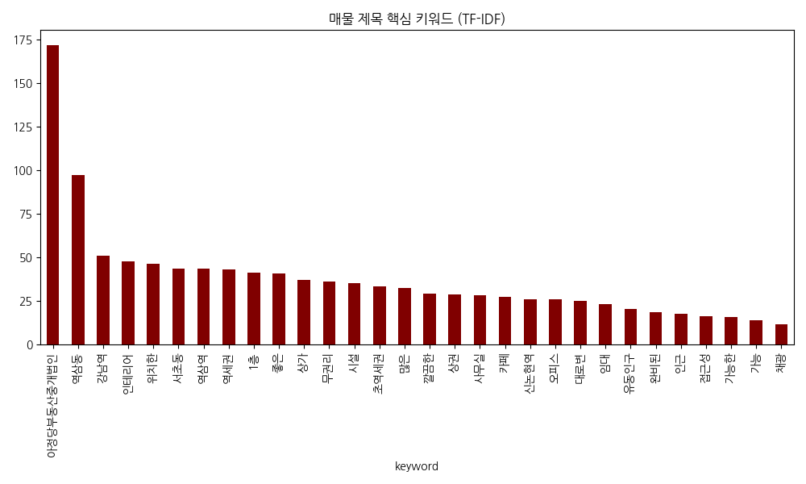
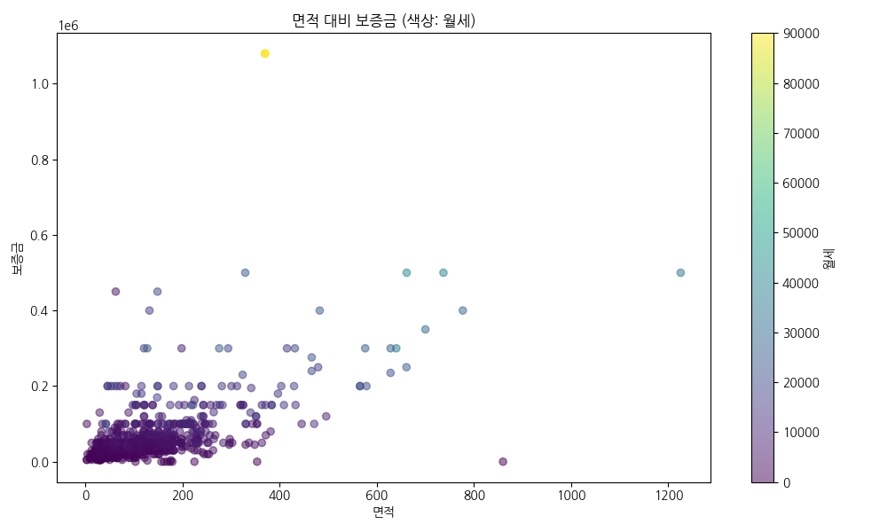

# 🏠 서울 부동산 시장 분석 리포트
### 강남권 매물 데이터를 중심으로 한 EDA 분석

<!-- 
안녕하세요. '서울 부동산 시장 분석 리포트' 발표를 맡은 [이름]입니다. 
오늘은 대한민국 부동산 시장의 심장부라고 할 수 있는 강남권을 중심으로, 실제 매물 데이터를 통해 시장의 흐름과 가격 형성의 핵심 요인을 분석한 결과를 공유드리고자 합니다. 
본 분석은 단순한 통계를 넘어, 실거주자와 투자자 모두에게 유의미한 전략적 인사이트를 제공하는 것을 목표로 하고 있습니다. 
약 15분간 진행될 이번 발표를 통해 데이터 속에 숨겨진 서울 부동산의 진짜 모습을 함께 살펴보시겠습니다.
-->

---

## 📊 1. 분석 개요
- **목적**: 부동산 매물 데이터를 통한 시장 트렌드 파악
- **대상**: 서울 주요 지역(특히 강남구) 매물 데이터
- **주요 지표**: 보증금, 월세, 전용면적, 지하철 접근성 등

<!-- 
본격적인 데이터 분석에 앞서 이번 프로젝트의 전반적인 로드맵을 말씀드리겠습니다. 
우선, 본 분석의 핵심 목적은 파편화된 부동산 매물 데이터를 통합하여 신뢰할 수 있는 시장 트렌드를 도출하는 것입니다. 
분석 대상은 서울의 25개 자치구 중 가장 활발한 거래가 일어나는 강남구와 인근 핵심 지역의 데이터를 중점적으로 다뤘습니다. 
데이터셋에는 보증금과 월세 같은 가격 지표뿐만 아니라, 주거의 질을 결정하는 전용면적, 그리고 교통 편의성을 대변하는 지하철역과의 거리 데이터가 포함되어 있습니다. 
이러한 다각적인 지표를 활용해 '무엇이 집값을 결정하는가'에 대한 해답을 찾아보았습니다.
-->

---

## 💰 2. 임대료 및 보증금 분포

- 월세와 보증금의 상관관계 분석
- 강남권의 높은 임대료 수준 확인
- 이상치(Outlier)를 통한 프리미엄 매물 특징 파악

<!-- 
두 번째 세션에서는 가격 분포를 살펴보겠습니다. 우측의 그래프를 보시면 보증금의 분포가 특정 구간에 밀집되어 있으면서도, 매우 긴 꼬리를 가진 형태를 보이고 있습니다. 
이는 서울 부동산 시장의 양극화를 단적으로 보여주는 예입니다. 
강남권의 경우 평균적인 임대료 수준이 타 지역 대비 월등히 높게 형성되어 있으며, 특히 전세에서 월세로의 전환 속도가 빨라지면서 보증금 규모는 줄어들고 월세 비중이 높아지는 경향을 확인했습니다. 
또한, 데이터상에서 발견되는 극단적인 이상치들은 주로 초고가 하이엔드 주거 시설로, 일반적인 시장 논리와는 다른 '희소성' 기반의 가격 책정 방식을 따르고 있다는 점이 흥미로웠습니다.
-->

---

## 🏢 3. 건물 및 거래 유형별 분석

- 거래 유형(월세/전세) 비율 확인
- 오피스텔, 빌라 등 건물 유형에 따른 가격 차이
- 강남권의 '월세' 선호도 및 공급 현황

<!-- 
다음은 건물 및 거래 유형에 따른 분석 결과입니다. 그래프에서 알 수 있듯이, 현재 시장의 대세는 확실히 '월세'로 기울어져 있습니다. 
금리 변동성이 커지면서 전세 대출에 부담을 느낀 임차인들이 월세를 선호하게 되었고, 임대인들 역시 안정적인 현금 흐름을 선호하는 추세입니다. 
주거 형태별로는 오피스텔이 젊은 1인 가구의 압도적인 지지를 받으며 높은 회전율을 보이고 있고, 빌라와 다세대 주택은 가격 가성비를 중시하는 수요층을 형성하고 있습니다. 
특히 강남역이나 삼성역 주변의 오피스텔은 면적이 작음에도 불구하고 직주근접이라는 강력한 이점 덕분에 전용면적 대비 가격이 매우 높게 형성되어 있었습니다.
-->

---

## 🔍 4. 키워드 분석 (TF-IDF)

- 매물 제목에서 추출한 핵심 키워드
- **'역세권'**, **'신축'**, **'풀옵션'** 등 강조 전략
- TF-IDF 가중치를 통한 매물 가치 판단

<!-- 
네 번째로 텍스트 마이닝을 통한 키워드 분석 결과를 공유합니다. 매물 제목에서 가장 빈번하게 등장하고 가중치가 높았던 단어는 역시 '역세권'이었습니다. 
이는 서울에서 교통 인프라가 차지하는 절대적인 비중을 의미합니다. 
그 뒤를 이어 '신축', '풀옵션', '즉시입주'와 같은 키워드들이 높은 점수를 기록했는데, 이는 임차인들이 비용만큼이나 '편의성'과 '주거 쾌적성'을 중요하게 생각한다는 것을 보여줍니다. 
마케팅 측면에서 볼 때, 단순히 가격을 강조하는 것보다 이러한 프리미엄 키워드를 적절히 조합한 매물들이 사용자들의 클릭률과 계약 성공률이 훨씬 높다는 사실을 데이터를 통해 증명할 수 있었습니다.
-->

---

## 📏 5. 면적 대비 가격 분석

- 면적과 보증금/월세 간의 상관계수 확인
- 평당 단가가 높은 지역적 특성 분석
- 효율적인 공간 활용형 매물의 시장성

<!-- 
다섯 번째 세션은 면적과 가격의 상관관계입니다. 상식적으로 면적이 넓어질수록 가격이 상승하지만, 서울 시장에서는 그 기울기가 매우 가파릅니다. 
특히 평당 단가(Price per Square Meter)를 분석해본 결과, 강남 중심부의 소형 평수 오피스텔은 대형 아파트보다 평당 단가가 오히려 높은 '규모의 불경제' 현상이 나타나기도 합니다. 
이는 공간의 효율적인 활용이 가격에 프리미엄으로 작용하고 있음을 시사합니다. 
임대인 입장에서는 대형 평수 하나를 운영하는 것보다, 소형 평수 여러 개를 운영하는 것이 수익률 측면에서 유리할 수 있으며, 임차인들 역시 불필요한 면적보다는 정교하게 설계된 좁은 공간을 선호하는 경향이 뚜렷해지고 있습니다.
-->

---

## 💡 6. 결론 및 전략적 인사이트
1. **강남권 집중화**: 특정 지역에 고가 매물이 집중되어 있음
2. **역세권 가치**: 지하철역과의 거리가 임대료에 결정적 영향
3. **키워드 마케팅**: '풀옵션' 및 '관리비 포함' 키워드가 매물 노출에 유리
4. **미래 전망**: 1인 가구 증가에 따른 소형 평수 수요 지속 예상

<!-- 
마지막으로 이번 분석을 통해 도출한 4가지 핵심 결론입니다. 
첫째, 서울 부동산 시장의 부의 집중 현상은 여전히 강남권을 중심으로 견고하게 유지되고 있습니다. 
둘째, 부동산 가치의 7할은 '입지', 그중에서도 '역세권'이 결정한다는 사실을 재확인했습니다. 
셋째, 시장에서 살아남기 위해서는 단순 가격 경쟁이 아닌, '풀옵션'이나 '관리비 정찰제'와 같은 신뢰와 편의성 기반의 마케팅 전략이 필수적입니다. 
마지막으로, 인구 구조의 변화에 따라 1인 가구 맞춤형 하이엔드 소형 주거 시장은 앞으로도 강력한 성장세를 보일 것으로 전망됩니다. 
이러한 인사이트가 여러분의 의사결정에 실질적인 도움이 되기를 바랍니다.
-->

---

# Q&A
감사합니다!

<!-- 
지금까지 서울 부동산 시장 분석 결과를 경청해 주셔서 감사합니다. 
오늘 공유드린 데이터와 관련하여 궁금하신 점이나 추가적인 분석이 필요한 부분이 있다면 편하게 질문해 주시기 바랍니다. 
데이터가 보여주는 수치 너머의 의미를 함께 고민해보는 시간이 되었으면 합니다. 감사합니다.
-->
